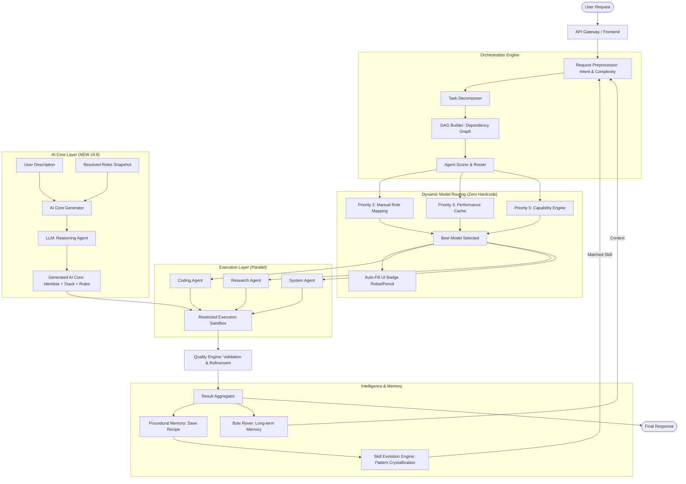

# 🧠 AI ORCHESTRATOR v4.0
### *Autonomous Execution, 5-Step Deep Reasoning & Pre-Execution Planning*

<p align="center">
  
  
  
  
  
  
</p>

---

## 📖 Overview

**AI ORCHESTRATOR** adalah platform orkestrasi AI mandiri (Self-Hosted) yang dirancang untuk mengeksekusi tugas-tugas kompleks melalui sistem multi-agent yang terkoordinasi. Berbeda dengan chat UI standar, sistem ini berfokus pada **Execution & Autonomy**, didukung oleh lapisan memori prosedural dan **Dynamic Model Routing** yang memungkinkannya memilih model AI terbaik secara otomatis untuk setiap jenis tugas — tanpa perlu menyentuh kode.

---

## 🆕 What's New in v4.0 — Full Autonomy, Enhanced Reasoning & Pre-Execution Planning

### 1. 🧠 Penalaran (Reasoning) 5-Tahap yang Jauh Lebih Kuat
AI Orchestrator kini dilengkapi dengan alur penalaran (*Reasoning Flow*) 5 tahap yang memaksa agen untuk berpikir lebih dalam sebelum mengeksekusi. Ini memungkinkannya memahami niat pengguna (*intent*) bahkan dari kalimat yang sangat pendek atau ambigu.

*   **Tahap 1 (Intent Inference):** Menebak maksud tersembunyi (contoh: *"perbaiki login"* → debug auth flow, cek token; *"lambat banget"* → profiling, optimize).
*   **Tahap 2 (Context Exploration):** Agen proaktif menggunakan tool `find_files`, `list_directory`, atau `read_file` jika konteks belum lengkap, tanpa perlu bertanya ke pengguna.
*   **Tahap 3 & 4 (Plan & Execute):** Menyusun tool calls secara sekuensial.
*   **Tahap 5 (Verify):** Mengevaluasi output tool untuk memastikan masalah benar-benar selesai.

### 2. 📋 Generator Rencana Implementasi (VS Code Copilot Style)
Untuk tugas yang dinilai kompleks (skor kompleksitas ≥ 0.45, seperti pembuatan aplikasi atau *refactoring* besar), sistem kini secara otomatis menyusun **Rencana Implementasi**.
*   **Plan Card UI:** Rencana ini ditampilkan di frontend dalam bentuk kartu (*card*) elegan ala *VS Code Copilot* lengkap dengan *syntax highlighting* dan indikator progres.
*   **Informational Only:** Rencana ini bersifat informasi; pengguna tidak perlu mengklik "Setuju". Orchestrator langsung mengeksekusi langkah-langkah tersebut secara otomatis.
*   **Auto-Dismiss:** Kartu rencana akan otomatis hilang dari layar setelah eksekusi selesai agar riwayat percakapan tetap bersih.

### 3. ⚡ Full Autonomy & Smart Project Location
Botol leher (*bottleneck*) interaksi manusia telah dihapus. AI Orchestrator kini adalah **Executor Mandiri 100%**:
*   **Zero-Interaction Execution:** Tidak ada lagi jeda untuk meminta persetujuan manual (sebelumnya menunggu 5 menit). AI langsung bertindak.
*   **Smart Popup:** Sistem hanya akan menjeda dan memunculkan *popup* lokasi penyimpanan **jika dan hanya jika** pengguna meminta membuat aplikasi/proyek baru (contoh: *"buatkan website"* atau *"bikin aplikasi"*) dan direktori belum ditentukan.
*   **Self-Resolving Paths:** Untuk tugas perbaikan atau pencarian, agen menggunakan tool `get_project_path` dan `find_files` untuk mencari lokasi secara otomatis.

---

## 🆕 What's New in v3.9 — Transparent Routing & AI Core Generator

### 1. 🤖 AI Roles Mapping Auto-Fill
Slot AI Roles Mapping yang dibiarkan kosong kini secara otomatis menampilkan model yang **benar-benar aktif dipilih oleh orchestrator** — tanpa perlu mengisi manual.

**Sebelum v3.9:**
- Slot kosong → tidak ada informasi model yang aktif
- Pengguna tidak bisa memantau keputusan auto-routing sistem

**Sesudah v3.9:**
- Slot kosong → ditampilkan `🤖 Auto — [nama model aktif]`
- Slot diisi manual → ditampilkan `✏️ Manual`
- Data di-refresh otomatis setiap 30 detik selama panel terbuka
- Dropdown menampilkan model aktif sebagai opsi default

**Endpoint baru:** `GET /api/settings/ai-roles/resolved`
```json
{
  "resolved": {
    "coding":    { "model_id": "deepseek-v4-pro", "display": "DeepSeek V4 Pro", "source": "auto" },
    "reasoning": { "model_id": "qwen3.6-plus",    "display": "Qwen3.6 Plus",    "source": "manual" }
  }
}
```

---

### 2. 🛡️ Manual Setting Protection — Garansi Pilihan Pengguna
Sistem kini memiliki **perlindungan eksplisit** yang menjamin pilihan manual pengguna tidak pernah ditimpa oleh auto-routing:

```
Pilihan Manual (AI_ROLE_CODING="deepseek-v4-pro")
   → resolve_model("coding") → Priority 2: baca env → RETURN deepseek-v4-pro ✅
   → refresh_perf_cache() jalan → hanya tulis _perf_cache (memory)
   → env AI_ROLE_CODING TIDAK PERNAH disentuh oleh auto-routing ✅

Pilihan Auto (AI_ROLE_CODING="" kosong)
   → Priority 2: skip → Priority 3: perf_cache → pilih model terbaik ✅
   → UI tampilkan hasil pilihan sistem dengan badge 🤖 Auto ✅
```

**Kontrak yang dijamin oleh kode:**

| Komponen | Jaminan |
|---|---|
| `resolve_model_for_agent()` | **HANYA MEMBACA** — tidak pernah menulis ke env |
| `refresh_perf_cache()` | **HANYA menulis ke `_perf_cache`** (dict di memory) |
| `save_ai_role_settings()` | Satu-satunya fungsi yang boleh menulis env, dipanggil **hanya** saat user klik "Simpan Pemetaan" |

---

### 3. ✨ Auto-Generate AI Core
Fitur baru di **Settings → AI Core**: pengguna cukup menulis deskripsi singkat, sistem akan otomatis men-generate AI Core (system prompt) yang lengkap dan siap pakai.

**Alur kerja:**
```
[1] Pengguna tulis deskripsi:
    "ARIA adalah AI untuk customer service, ramah, bilingual ID-EN,
     fokus di e-commerce dan teknis produk."
          ↓
[2] Sistem baca AI Roles Mapping aktif (12 role, real-time)
          ↓
[3] LLM (reasoning agent) generate AI Core lengkap:
    - IDENTITAS         — nama, peran, kepribadian, bahasa
    - KEMAMPUAN UTAMA   — berdasarkan deskripsi user
    - MODEL STACK       — pakai alias [RUNNER], [BRAIN], dll.
    - ROUTING RULES     — kapan orchestrator pilih agent mana
    - ATURAN PERILAKU   — sesuai deskripsi user
    - BATASAN & KEAMANAN — relevan dengan use case
          ↓
[4] Preview dengan animasi streaming (~60fps)
    Meta: model yang dipakai, jumlah karakter, jumlah roles
          ↓
[5] Pengguna review → klik "Terapkan" → klik "Simpan AI Core"
```

**Fitur UI:**
- 🕐 **Riwayat Generate** — 5 entri terakhir tersimpan di `localStorage`, bisa di-restore kapan saja
- **Regenerate** — generate ulang dengan deskripsi yang sama, hasil bisa berbeda
- **Nama model tidak bocor** — AI Core selalu menggunakan alias internal, tidak pernah menyebut nama model asli kepada pengguna akhir

**Endpoint baru:** `POST /api/settings/ai-core/generate`
```json
// Request
{ "description": "ARIA untuk customer service...", "language": "id" }

// Response
{
  "generated_prompt": "## IDENTITAS\nNama: ARIA...",
  "model_used":       "qwen3.6-plus",
  "model_display":    "Qwen3.6 Plus",
  "roles_snapshot":   { "general": {...}, "coding": {...} },
  "chars":            1842
}
```

---

## 🆕 What's New in v3.8 — Dynamic AI Role Mapping

### Zero Hardcode Model Names
Seluruh nama model AI telah dihapus dari kode internal. Routing kini 100% dinamis berdasarkan konfigurasi di menu **Integrasi → AI Roles Mapping**.

### AI Roles Mapping (12 Slot)
Pengguna dapat memetakan model pilihan ke setiap jenis agent secara mandiri langsung dari UI:

| Slot | Agent | Kegunaan |
|------|-------|----------|
| 💬 | Chat Umum | Percakapan, FAQ, pertanyaan ringan |
| 💻 | Coding | Programming, debugging, code review |
| 🧠 | Reasoning | Logika kompleks, analisis, matematika |
| ✍️ | Penulisan | Konten, dokumentasi, terjemahan |
| 🔍 | Riset | Pencarian info, fact-checking, web |
| 🖥️ | Sistem/DevOps | VPS, terminal, server, networking |
| 🎨 | Kreatif | Brainstorming, ide, storytelling |
| ✅ | Validasi/QA | Verifikasi, testing, fact-check |
| 👁️ | Vision | Analisis gambar, OCR, deteksi objek |
| 🌐 | Multimodal | Teks + gambar + audio sekaligus |
| 🔊 | Audio/TTS | Text-to-speech, suara |
| 🖼️ | Image Generation | Buat gambar dari teks |

### Auto-Routing Cerdas (Self-Learning)
Jika AI Roles Mapping dikosongkan, sistem secara otomatis memilih model terbaik melalui **7 lapis prioritas**:

```
1. Model dipilih user secara eksplisit (override sesi)
2. AI_ROLE_<TYPE> dari env (pilihan MANUAL user — dihormati sepenuhnya, tidak pernah ditimpa)
3. Performance Cache (auto-learning dari riwayat eksekusi — refresh tiap 5 menit)
4. Dynamic routing cache (model_classifier keyword matching)
5. Capability-based search dari model aktif di Integrasi
6. Model tersedia pertama yang relevan (exclude audio untuk non-audio tasks)
7. Default model fallback
```

> **Priority 2 adalah sacred** — selama user mengisi slot manual, orchestrator **wajib** menggunakannya. Auto-learning hanya aktif di Priority 3 ke bawah, dan tidak pernah menimpa konfigurasi user.

---

## 🏛️ System Architecture



---

## 📊 Performance Metrics

| Metrik | Nilai | Keterangan |
|---|---|---|
| Context Efficiency | **63%** reduksi token | QMD (Query Memory Distillation), maks 81% pada chat panjang |
| Routing Accuracy | **>85%** | Setelah 10+ sesi, performance-based auto-routing |
| Manual Override Guarantee | **100%** | Priority 2 selalu dihormati, tidak pernah ditimpa |
| Auto-Fill Refresh Rate | **30 detik** | UI sync real-time dengan keputusan orchestrator |
| AI Core Generate Time | **3–8 detik** | Streaming preview, tidak perlu tunggu selesai |

---

## 🛡️ Core Stability Features (Technical Proof)

### 1. Hardened Execution Layer (Output Truncation Recovery)
Alih-alih berhenti saat mencapai limit token, sistem ini mendeteksi kondisi output menggantung secara heuristik:
*   **Detection:** Memeriksa status blok kode (backticks), tag HTML yang tidak ditutup, dan kelengkapan sintaksis di akhir stream.
*   **Resumption:** Jika terdeteksi terpotong, sistem secara otomatis menginjeksikan pesan kelanjutan sekuensial tanpa mengulang konten sebelumnya.

### 2. QMD (Query Memory Distillation)
Lapisan kompresi konteks adaptif yang menggunakan algoritma distilasi untuk membuang redundansi dalam riwayat percakapan. Hanya metadata penting dan "resep" dari `Procedural Memory` yang dipertahankan dalam jendela konteks aktif.

### 3. Procedural Memory & Skill Crystallization
Bukan sekadar menyimpan chat, sistem mengekstraksi **Execution Graphs** yang berhasil:
*   **Recipe Extraction:** Menyimpan urutan tool calls dan argumen yang membuahkan hasil sukses.
*   **Pattern Matching:** Menggunakan Vector Similarity (ChromaDB) untuk mencocokkan request baru dengan resep yang ada.
*   **Crystallization:** Jika pola yang sama berhasil ≥ 5x dengan skor confidence > 0.7, sistem mengonversinya menjadi **LearnedSkill** permanen yang melewati fase reasoning awal.

### 4. Dynamic Model Routing (v3.8) + Transparent Routing (v3.9)
*   **Zero Hardcode:** Tidak ada nama model AI di dalam kode agent, scorer, maupun orchestrator.
*   **Self-Learning:** `AgentPerformance` table dianalisis setiap 5 menit untuk menemukan model terbaik per agent type.
*   **Plug & Play:** Tambah model baru di Integrasi → sistem otomatis mengenali dan mempertimbangkannya.
*   **Transparent:** UI menampilkan secara real-time model mana yang dipilih sistem untuk setiap role, tanpa perlu menebak-nebak.

### 5. AI Core Generator (v3.9)
*   **Input-to-Core:** Deskripsi natural language → AI Core profesional dalam <10 detik.
*   **Role-Aware:** Generator membaca stack model aktif dan menyesuaikan routing rules dengan model yang benar-benar tersedia.
*   **Privacy-Safe:** Nama model internal tidak pernah muncul di AI Core yang di-generate (menggunakan alias [RUNNER], [BRAIN], dll.).
*   **History & Rollback:** Riwayat 5 generate terakhir tersimpan, bisa di-restore kapan saja.

---

## 📝 Design Philosophy & Scope

| ✅ What This IS | ❌ What This IS NOT |
| :--- | :--- |
| **Deterministic-First:** Memprioritaskan tool dan langkah pasti sebelum menggunakan reasoning LLM. | **Autonomous AGI:** Sistem ini tidak memiliki kesadaran atau tujuan sendiri di luar instruksi user. |
| **Tool-Constrained:** Hanya bisa berinteraksi dengan sistem melalui API dan tool yang didefinisikan secara eksplisit. | **Unsandboxed Control:** Tidak memiliki akses bebas ke kernel sistem tanpa pengawasan container. |
| **Auditable:** Setiap langkah, pemikiran (thinking), dan aksi dicatat secara detail dalam log eksekusi. | **Unrestricted Self-Modifying:** Sistem tidak bisa mengubah kode inti engine-nya sendiri. |
| **Human-Overridable:** User memiliki kontrol penuh — pilihan manual **tidak pernah ditimpa** oleh auto-routing. | **Black-Box System:** Tidak ada tindakan "gaib"; semua berasal dari proses orkestrasi yang terstruktur. |
| **Zero-Hardcode Routing:** Nama model AI tidak pernah ditulis di dalam kode — sepenuhnya dikonfigurasi via UI. | **Vendor Lock-in:** Sistem tidak terikat pada provider AI tertentu; mudah diganti tanpa ubah kode. |
| **Transparent Routing:** UI menampilkan model aktif per role secara real-time dengan badge Auto/Manual. | **Opaque Decision:** Pengguna selalu bisa melihat dan memverifikasi keputusan routing sistem. |

---

## 🚀 Real Execution Trace (Example)

**Input:** *"Bangun landing page produk kopi, tambahkan form kontak, dan siapkan script deploy ke VPS."*

1.  **Decomposition:** Sistem memecah menjadi 4 sub-task: (A) Desain UI, (B) Backend Form, (C) Dockerization, (D) Deployment Script.
2.  **Dynamic Routing:** Agent Scorer membaca AI Roles Mapping → jika tidak dikonfigurasi, cek Performance Cache → lalu Capability Engine memilih model terbaik yang tersedia untuk setiap sub-task.
3.  **Parallel Coding:** Agent-1 menulis HTML/CSS, Agent-2 menulis handler Python untuk form secara simultan.
4.  **Truncation Recovery:** Saat menulis CSS yang sangat panjang, output terpotong di baris 150. Sistem mendeteksi dan melanjutkan secara otomatis hingga selesai.
5.  **Validation:** `Quality Engine` mencoba menjalankan `npm build`. Menemukan error import, memanggil `execute_bash` untuk fix, dan build ulang hingga sukses.
6.  **Procedural Memory:** Urutan tool calls yang berhasil disimpan sebagai "Recipe: Web Landing Page".
7.  **Self-Learning:** Performance hasil eksekusi dicatat ke `AgentPerformance` table — di sesi berikutnya, sistem otomatis memilih model yang sama karena terbukti berhasil.

---

## 🛠️ On-Demand Execution Tools
*   **🌐 Browser Automation**: Playwright integration untuk web research & UI testing.
*   **👁️ VISION_GATE**: Multimodal analysis untuk memahami konteks visual.
*   **🏛️ Command Center**: Koordinasi paralel untuk task heavy-duty.
*   **🛡️ CVE Scanner**: Audit keamanan otomatis untuk dependency Python/Node.js.
*   **🔊 Byte Rover**: Long-term memory summarization & context compression.

---

## ⚡ Instalasi
Cukup satu perintah untuk menjalankan seluruh stack melalui Docker:
```bash
docker compose up -d
```

---

## 📄 Lisensi
Copyright (c) 2026 **maztfajarwahyudi**. Proprietary - View Only.

---

<p align="center">
  <i>Focus on Execution. Built for Engineers.</i><br>
  <b>AI ORCHESTRATOR v4.0 — Full Autonomy, 5-Step Reasoning, Pre-Execution Planning.</b>
</p>
