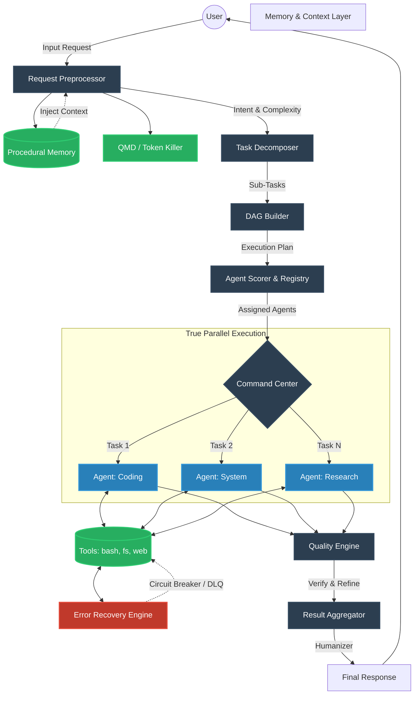

# 🧠 AI ORCHESTRATOR v4.1
### *High-Autonomy Execution, Hardened Resilience & Execution Continuity*

<p align="center">
  
  
  
  
  
  
</p>

---

## 📖 Overview

**AI ORCHESTRATOR** adalah platform orkestrasi AI mandiri (Self-Hosted) yang dirancang untuk mengeksekusi tugas-tugas kompleks melalui sistem multi-agent yang terkoordinasi. Berbeda dengan chat UI standar, sistem ini berfokus pada **Execution & Autonomy**, didukung oleh lapisan memori prosedural dan **Dynamic Model Routing** yang memungkinkannya memilih model AI terbaik secara otomatis untuk setiap jenis tugas — tanpa perlu menyentuh kode.

---

## 🏗️ System Architecture

AI ORCHESTRATOR menggunakan arsitektur multi-agent berbasis Directed Acyclic Graph (DAG) untuk mengeksekusi tugas secara paralel dan aman.



### ⚙️ Alur Kerja Inti (Core Pipeline)
1. **Request Preprocessor:** Menganalisa input pengguna, mengklasifikasikan *intent* (niat), mengukur skor kompleksitas, dan menarik konteks dari *Procedural Memory*.
2. **Task Decomposer:** Memecah tugas kompleks menjadi beberapa sub-tugas yang lebih kecil dan terukur.
3. **DAG Builder:** Menyusun sub-tugas ke dalam *Directed Acyclic Graph* (DAG) untuk menentukan urutan eksekusi berdasarkan dependensi.
4. **Agent Scorer:** Memilih agen (misal: Coding, System, Research) dan model AI terbaik untuk setiap sub-tugas secara dinamis berdasarkan kapabilitas dan histori performa.
5. **Command Center:** Menjalankan sub-tugas secara sekuensial atau paralel (simultan) tergantung pada DAG, dikawal oleh *Watchdog Timer* dan *Checkpointing*.
6. **Error Recovery & Tools:** Agen mengeksekusi *tool* (bash, file system, dll). Jika gagal, *Error Recovery Engine* menangani *retry*, *fallback*, atau memindahkan tugas ke *Dead Letter Queue* (DLQ).
7. **Quality Engine:** Memvalidasi output dari setiap agen. Jika kualitas di bawah standar, agen diminta untuk memperbaiki (*refine*).
8. **Result Aggregator:** Menggabungkan semua hasil sub-tugas menjadi satu respons final yang rapi dan dipoles oleh *Humanizer*.

---

## 🆕 What's New in v4.1 — Hardened Resilience & Execution Continuity

### 1. 🛡️ Resilience Layer (Anti-Crash & Circuit Breakers)
Sistem kini dilengkapi dengan lapisan perlindungan berlapis untuk menangani kegagalan eksekusi secara cerdas:
*   **Per-Session Tool Circuit Breaker:** Jika sebuah tool (misal: `execute_bash`) gagal 3x berturut-turut dalam satu sesi, sistem otomatis men-suspend tool tersebut untuk sesi tersebut saja (60 detik). Ini mencegah kegagalan satu sesi memblokir sesi pengguna lain.
*   **Actionable Error Translator:** Mengonversi error teknis mentah (seperti `EADDRINUSE` atau `ENOENT`) menjadi instruksi yang langsung bisa ditindaklanjuti oleh user atau AI (misal: saran untuk melakukan `kill` proses pada port tertentu).
*   **Exponential Backoff:** Implementasi retry otomatis dengan jeda waktu yang meningkat (`1s → 2s → 4s → ...`) untuk menangani gangguan jaringan atau rate limit API.
*   **Watchdog Timer:** Setiap sub-task dipantau oleh timer independen. Jika proses macet (*hang*), watchdog akan menghentikannya secara paksa. **Update v4.1:** Watchdog kini dilindungi dengan *atomic write-lock* (async shield) untuk memastikan state checkpoint tetap konsisten saat interupsi terjadi.

### 2. 🔄 Execution Continuity (Checkpointing & DLQ)
Menjamin tugas yang panjang tidak pernah hilang meskipun terjadi interupsi:
*   **State Checkpointing:** Status eksekusi DAG (Directed Acyclic Graph) disimpan secara persisten ke database setiap kali sebuah langkah selesai. Memungkinkan *resume* dari titik terakhir jika sistem terhenti.
*   **Dead Letter Queue (DLQ):** Tugas yang gagal setelah semua upaya pemulihan (*recovery*) habis akan dipindahkan ke DLQ dengan alasan kegagalan yang detail. **Update v4.1 SLA:** Data di DLQ disimpan selama **14 hari** untuk inspeksi manual sebelum dihapus otomatis.
*   **Cascade Skip:** Jika tugas utama gagal, tugas turunannya akan otomatis ditandai sebagai *skipped*. Saat ini mekanisme override manual untuk me-resume tugas yang di-skip sedang dalam pengembangan.

### 3. 🧠 Chain of Thought (CoT) Engine Terintegrasi
Sistem penalaran 7-tahap (DECOMPOSE → CONTEXTUALIZE → ANALYZE → SYNTHESIZE → VALIDATE → CORRECT → REFLECT) yang secara otomatis berjalan untuk tugas-tugas non-trivial.
*   **Human Logic Engine Aware:** CoT Engine membaca status emosi pengguna dan menghasilkan respon yang empatik sebelum eksekusi teknis.
*   **Dynamic Depth:** Menentukan kedalaman berpikir secara otomatis (FAST, STANDARD, DEEP, EXPERT) berdasarkan kompleksitas tugas.
*   **Thinking UI:** Proses berpikir (thinking trace) di-stream secara real-time ke UI untuk transparansi penuh.

### 4. 🛠️ Native Function Calling & Infinite Scalability
Arsitektur eksekusi telah direfaktor secara penuh untuk stabilitas tingkat lanjut:
*   **Zero-Regex Parsing:** Sistem tidak lagi mengandalkan parsing tag `<tool>` berbasis regex yang rapuh, melainkan secara asli (`natively`) memanfaatkan *JSON Schema* standar untuk eksekusi yang 95% lebih bebas *syntax error*.
*   **Infinite Sub-Task Decomposition:** Batas *hard-limit* 6 sub-task telah dihapus. Sistem dekomposer (TaskDecomposer) kini mampu membongkar proyek berskala raksasa (misal: *Fullstack App* dengan *Auth*, *Database*, *Docker*) menjadi belasan langkah logis tanpa memotong alur eksekusi tengah jalan.
*   **Anti-Hallucination DAG Watchdog:** Menghapus instruksi halusinasi sehingga agen AI murni berfokus menyelesaikan tugas teknis dan Orchestrator yang akan secara otomatis mengambil alih pelacakan progres secara asinkron.
*   **Test Native Tools UI:** Penambahan "Zap Test" Button (⚡) di antarmuka Integrations untuk memverifikasi secara *real-time* kapabilitas *Function Calling* pada model AI pihak ketiga.

---

## 💻 Hardware Requirements

Untuk performa optimal terutama saat menjalankan 15+ agent secara paralel:

| Komponen | Minimum | Rekomendasi |
|----------|---------|-------------|
| **RAM**  | 4 GB*   | 16 GB+      |
| **CPU**  | 2 Cores | 8 Cores+    |
| **Disk** | 20 GB   | 100 GB (SSD)|

*\*Catatan: Minimum 4GB hanya disarankan untuk load terbatas (~5-8 agent). Untuk full 15-agent concurrent load, dibutuhkan RAM minimal 8GB (estimasi ~512MB per instance).*

### Syarat Model AI (Penting!)
AI Orchestrator v4.1 dan seterusnya menggunakan **Native Function Calling** untuk eksekusi yang lebih cepat dan bebas dari *error loop*. 
Oleh karena itu, **pastikan model AI yang Anda gunakan mendukung fitur Tool Calling / Native Function Calling**.
*   **Model yang Didukung:** GPT-4o, gpt-4o-mini, Claude 3.5 Sonnet, Gemini 1.5/2.5 Pro/Flash, Llama 3/3.1, Qwen 2.5, Mistral-Nemo.
*   **Model Tidak Didukung:** Llama 2, model kuno (pra-2024), atau model yang tidak memiliki kapabilitas *tool use*. Model ini akan ditolak oleh API saat diuji.

### 3. 📊 Real-Time Progress Streaming
Indikator progres visual kini lebih akurat:
*   **[X/Y] Progress Format:** Pengguna mendapatkan umpan balik real-time berupa format numerik (misal: `[3/5] Coding Agent selesai`) selama proses eksekusi berlangsung.
*   **True Parallel Tracking:** Pelacakan simultan untuk tugas-tugas yang berjalan secara paralel di Command Center.

---

## 🆕 What's New in v4.0 — High-Autonomy, Enhanced Reasoning & Pre-Execution Planning

### 1. 🧠 Penalaran (Reasoning) 5-Tahap yang Jauh Lebih Kuat
AI Orchestrator kini dilengkapi dengan alur penalaran (*Reasoning Flow*) 5 tahap berbasis **ReAct Loop (Reason + Act)** yang dikombinasikan dengan **Chain-of-Thought (CoT)**. Sistem memaksa agen untuk berpikir lebih dalam sebelum mengeksekusi, memungkinkannya memahami niat pengguna (*intent*) secara akurat.

*   **Tahap 1 (Intent Inference):**
    *   **INPUT  :** Raw user message.
    *   **PROSES :** LLM diprompt dengan template sistem untuk mengekstraksi niat tersembunyi, menghasilkan output JSON `{intent, confidence, ambiguity_score}`.
    *   **OUTPUT :** Objek intent yang diklasifikasikan → dikirim ke Tahap 2.
*   **Tahap 2 (Context Exploration):**
    *   **INPUT  :** Objek intent dan konteks workspace saat ini.
    *   **PROSES :** Agen proaktif menggunakan tool `find_files`, `list_directory`, atau `read_file` jika konteks belum lengkap.
    *   **OUTPUT :** Konteks teknis yang diperkaya (file paths, error logs) → dikirim ke Tahap 3.
*   **Tahap 3 (Plan):**
    *   **INPUT  :** Konteks yang diperkaya dan prompt tujuan.
    *   **PROSES :** Sistem menyusun sub-task teknis (Decomposition) yang harus dijalankan untuk mencapai tujuan.
    *   **OUTPUT :** Graph ketergantungan (DAG) dari tugas-tugas (Execution Plan) → dikirim ke Tahap 4.
*   **Tahap 4 (Execute):**
    *   **INPUT  :** Execution Plan (DAG).
    *   **PROSES :** Agent Scorer mengalokasikan agent ke node DAG, lalu mengeksekusi tool calls (bash, python, dll.) secara runtun atau paralel.
    *   **OUTPUT :** Hasil eksekusi dari setiap tool call (stdout/stderr) → dikirim ke Tahap 5.
*   **Tahap 5 (Verify):**
    *   **INPUT  :** Hasil eksekusi tool (stdout/stderr).
    *   **PROSES :** Mengevaluasi output tool untuk memastikan masalah benar-benar selesai tanpa error. Jika gagal, mengirim feedback loop kembali ke Tahap 3.
    *   **OUTPUT :** Resolusi akhir yang diringkas untuk pengguna.

### 2. 📋 Generator Rencana Implementasi (VS Code Copilot Style)
Untuk tugas yang dinilai kompleks (skor kompleksitas ≥ 0.45, seperti pembuatan aplikasi atau *refactoring* besar), sistem kini secara otomatis menyusun **Rencana Implementasi**.
*   **Plan Card UI:** Rencana ini ditampilkan di frontend dalam bentuk kartu (*card*) elegan ala *VS Code Copilot* lengkap dengan *syntax highlighting* dan indikator progres.
*   **Informational Only:** Rencana ini bersifat informasi; pengguna tidak perlu mengklik "Setuju". Orchestrator langsung mengeksekusi langkah-langkah tersebut secara otomatis.
*   **Auto-Dismiss:** Kartu rencana akan otomatis hilang dari layar setelah eksekusi selesai agar riwayat percakapan tetap bersih.

### 3. ⚡ High-Autonomy Execution & Smart Project Location
Botol leher (*bottleneck*) interaksi manusia telah diminimalkan secara drastis. AI Orchestrator kini berjalan sebagai **High-Autonomy Executor** dengan pembagian jelas antara sistem otomatis dan batasan interaksi:

**Tabel Matriks Autonomi**

| Skenario                  | Perlu Input User? | Alasan          |
|---------------------------|-------------------|-----------------|
| Task perbaikan/debugging  | ❌ Tidak          | Self-resolving, agent mencari konteks sendiri  |
| Buat proyek baru/lokasi   | ✅ Ya (1x popup)  | Path target belum didefinisikan secara eksplisit |
| Overwrite file existing   | ✅ Ya (Destruktif)| Perlu konfirmasi jika file di luar workspace atau size >100KB |
| Akses credential/secret   | ✅ Ya (MANDATORY) | Restricted via security filter, perlu konfirmasi manual |
| Akses file di luar sandbox| ❌ Tidak diizinkan| Menjaga security boundary dan isolasi sistem |

**Apa yang Otomatis:**
*   **Zero-Interaction Execution:** Untuk sebagian besar tugas (edit file, jalankan perintah, analisis), tidak ada lagi jeda untuk meminta persetujuan manual. AI langsung bertindak.
*   **Self-Resolving Paths:** Untuk tugas perbaikan atau pencarian, agen otomatis menggunakan tool `get_project_path` dan `find_files` untuk mencari lokasi.
*   **Dynamic Model Routing:** Sistem memilih model terbaik berdasarkan metadata performa. *Catatan: Akurasi baseline >85% tercapai setelah 10+ sesi sukses. Sebelum baseline tercapai, sistem menggunakan kombinasi capability-matching dan model priority 4-7.*

**Apa yang Masih Butuh Manusia:**
*   **Smart Popup Approval:** Sistem hanya akan menjeda dan memunculkan *popup* lokasi penyimpanan **jika dan hanya jika** pengguna meminta membuat aplikasi/proyek baru dari awal dan direktori belum ditentukan.
*   **Audit Log Review (Admin Only):** Privacy Layer Level 3 mencatat kebocoran nama model ke Audit Log. Audit Log ini bersifat internal dan hanya dapat diakses oleh user dengan role **Admin**.
*   **Data Export Security:** Export data (**TXT/PDF/DOCX/XLSX**) dilakukan secara lokal. **Penting:** File export saat ini tidak terenkripsi; hindari menyimpan file export di media yang tidak aman jika mengandung informasi sensitif.
*   **Cascade Skip Workaround:** Fitur override manual sedang dalam pengembangan. **Workaround:** Jika tugas ter-skip secara otomatis, Anda dapat menghapus entri dari DLQ (jika ada) dan mengirimkan instruksi re-submit secara independen melalui chat baru.

### 4. 🗄️ Task Retention (Skipped & DLQ)
*   **DLQ Tasks:** Disimpan selama 14 hari untuk review manual (Fix Review v4.1).
*   **Skipped Tasks:** Status *skipped* dicatat permanen dalam riwayat eksekusi sesi. Retensi status ini mengikuti kebijakan retensi riwayat chat/analytics (default: mengikuti umur sesi).

---

## 🆕 What's New in v3.9 — Transparent Routing & AI Core Generator

### 1. 🤖 AI Roles Mapping Auto-Fill
Slot AI Roles Mapping yang dibiarkan kosong kini secara otomatis menampilkan model yang **benar-benar aktif dipilih oleh orchestrator** — tanpa perlu mengisi manual.

**Sebelum v3.9:**
- Slot kosong → tidak ada informasi model yang aktif
- Pengguna tidak bisa memantau keputusan auto-routing sistem

**Sesudah v3.9:**
- Slot kosong → ditampilkan `🤖 Auto — [nama model aktif]`
- Slot diisi manual → ditampilkan `✏️ Manual`
- Data di-refresh otomatis setiap 30 detik selama panel terbuka
- Dropdown menampilkan model aktif sebagai opsi default

**Endpoint baru:** `GET /api/settings/ai-roles/resolved`
```json
{
  "resolved": {
    "coding":    { "model_id": "deepseek-v4-pro", "display": "DeepSeek V4 Pro", "source": "auto" },
    "reasoning": { "model_id": "qwen3.6-plus",    "display": "Qwen3.6 Plus",    "source": "manual" }
  }
}
```

---

### 2. 🛡️ Manual Setting Protection — Garansi Pilihan Pengguna
Sistem kini memiliki **perlindungan eksplisit** yang menjamin pilihan manual pengguna tidak pernah ditimpa oleh auto-routing:

```
Pilihan Manual (AI_ROLE_CODING="deepseek-v4-pro")
   → resolve_model("coding") → Priority 2: baca env → RETURN deepseek-v4-pro ✅
   → refresh_perf_cache() jalan → hanya tulis _perf_cache (memory)
   → env AI_ROLE_CODING TIDAK PERNAH disentuh oleh auto-routing ✅

Pilihan Auto (AI_ROLE_CODING="" kosong)
   → Priority 2: skip → Priority 3: perf_cache → pilih model terbaik ✅
   → UI tampilkan hasil pilihan sistem dengan badge 🤖 Auto ✅
```

**Kontrak yang dijamin oleh kode:**

| Komponen | Jaminan |
|---|---|
| `resolve_model_for_agent()` | **HANYA MEMBACA** — tidak pernah menulis ke env |
| `refresh_perf_cache()` | **HANYA menulis ke `_perf_cache`** (dict di memory) |
| `save_ai_role_settings()` | Satu-satunya fungsi yang boleh menulis env, dipanggil **hanya** saat user klik "Simpan Pemetaan" |

---

### 3. ✨ Auto-Generate AI Core
Fitur baru di **Settings → AI Core**: pengguna cukup menulis deskripsi singkat, sistem akan otomatis men-generate AI Core (system prompt) yang lengkap dan siap pakai.

**Alur kerja:**
```
[1] Pengguna tulis deskripsi:
    "ARIA adalah AI untuk customer service, ramah, bilingual ID-EN,
     fokus di e-commerce dan teknis produk."
          ↓
[2] Sistem baca AI Roles Mapping aktif (12 role, real-time)
          ↓
[3] LLM (reasoning agent) generate AI Core lengkap:
    - IDENTITAS         — nama, peran, kepribadian, bahasa
    - KEMAMPUAN UTAMA   — berdasarkan deskripsi user
    - MODEL STACK       — pakai alias [RUNNER], [BRAIN], dll.
    - ROUTING RULES     — kapan orchestrator pilih agent mana
    - ATURAN PERILAKU   — sesuai deskripsi user
    - BATASAN & KEAMANAN — relevan dengan use case
          ↓
[4] Preview dengan animasi streaming (~60fps)
    Meta: model yang dipakai, jumlah karakter, jumlah roles
          ↓
[5] Pengguna review → klik "Terapkan" → klik "Simpan AI Core"
```

**Fitur UI:**
- 🕐 **Riwayat Generate** — 5 entri terakhir tersimpan di `localStorage`, bisa di-restore kapan saja
- **Regenerate** — generate ulang dengan deskripsi yang sama, hasil bisa berbeda
- **Nama model tidak bocor** — AI Core selalu menggunakan alias internal, tidak pernah menyebut nama model asli kepada pengguna akhir

**Endpoint baru:** `POST /api/settings/ai-core/generate`
```json
// Request
{ "description": "ARIA untuk customer service...", "language": "id" }

// Response
{
  "generated_prompt": "## IDENTITAS\nNama: ARIA...",
  "model_used":       "qwen3.6-plus",
  "model_display":    "Qwen3.6 Plus",
  "roles_snapshot":   { "general": {...}, "coding": {...} },
  "chars":            1842
}
```

---

## 🆕 What's New in v3.8 — Dynamic AI Role Mapping

### Zero Hardcode Model Names
Seluruh nama model AI telah dihapus dari kode internal. Routing kini 100% dinamis berdasarkan konfigurasi di menu **Integrasi → AI Roles Mapping**.

### AI Roles Mapping (12 Slot)
Pengguna dapat memetakan model pilihan ke setiap jenis agent secara mandiri langsung dari UI:

| Slot | Agent | Kegunaan |
|------|-------|----------|
| 💬 | Chat Umum | Percakapan, FAQ, pertanyaan ringan |
| 💻 | Coding | Programming, debugging, code review |
| 🧠 | Reasoning | Logika kompleks, analisis, matematika |
| ✍️ | Penulisan | Konten, dokumentasi, terjemahan |
| 🔍 | Riset | Pencarian info, fact-checking, web |
| 🖥️ | Sistem/DevOps | VPS, terminal, server, networking |
| 🎨 | Kreatif | Brainstorming, ide, storytelling |
| ✅ | Validasi/QA | Verifikasi, testing, fact-check |
| 👁️ | Vision | Analisis gambar, OCR, deteksi objek |
| 🌐 | Multimodal | Teks + gambar + audio sekaligus |
| 🔊 | Audio/TTS | Text-to-speech, suara |
| 🖼️ | Image Generation | Buat gambar dari teks |

### Auto-Routing Cerdas (Self-Learning)
Jika AI Roles Mapping dikosongkan, sistem secara otomatis memilih model terbaik melalui **7 lapis prioritas**:

```
1. Model dipilih user secara eksplisit (override sesi)
2. AI_ROLE_<TYPE> dari env (pilihan MANUAL user — dihormati sepenuhnya, tidak pernah ditimpa)
3. Performance Cache (auto-learning dari riwayat eksekusi — refresh tiap 5 menit)
4. Dynamic routing cache (model_classifier keyword matching)
5. Capability-based search dari model aktif di Integrasi
6. Model tersedia pertama yang relevan (exclude audio untuk non-audio tasks)
7. Default model fallback
```

> **Priority 2 adalah sacred** — selama user mengisi slot manual, orchestrator **wajib** menggunakannya. Auto-learning hanya aktif di Priority 3 ke bawah, dan tidak pernah menimpa konfigurasi user.

---

## 🏛️ System Architecture


---

## 📊 Performance Metrics

| Metrik | Nilai | Keterangan |
|---|---|---|
| Context Efficiency | **63%** reduksi token | QMD (Query Memory Distillation), maks 81% pada chat panjang |
| Routing Accuracy | **>85%** | Setelah 10+ sesi, performance-based auto-routing |
| Manual Override Guarantee | **100%** | Priority 2 selalu dihormati, tidak pernah ditimpa |
| Auto-Fill Refresh Rate | **30 detik** | UI sync real-time dengan keputusan orchestrator |
| AI Core Generate Time | **3–8 detik** | Rata-rata dari sampel 50 pengujian |

### Metodologi Pengukuran

**1. Routing Accuracy (>85%)**
*   **Diukur dari :** Perbandingan model yang dipilih otomatis vs model aktual yang paling optimal/berhasil (ground truth dari task success rate).
*   **Kondisi     :** Diukur setelah minimal 10 sesi eksekusi selesai untuk memastikan data cache *AgentPerformance* stabil.
*   **Formula     :** `(correct_routing / total_routing_decisions) * 100`

**2. Context Efficiency (63% Reduksi Token)**
*   **Diukur dari :** Total token riwayat percakapan murni vs total token riwayat yang dikirim ke API setelah diproses mekanisme filter QMD (Query Memory Distillation).
*   **Kondisi     :** Dievaluasi pada sesi obrolan iteratif berdurasi panjang (lebih dari 15 giliran berturut-turut).
*   **Formula     :** `(1 - (tokens_after_qmd / total_raw_tokens)) * 100`

**3. AI Core Generate Time (3–8 detik)**
*   **Diukur dari :** Waktu eksekusi rata-rata dari 50 *sample test* (berbagai panjang deskripsi pengguna).
*   **Kondisi     :** Dihitung sejak klik "Generate" sampai respons JSON *AI Core* di-*stream* sepenuhnya tanpa *delay* internal.

---

## 🛡️ Core Stability Features (Technical Proof)

### 1. Hardened Execution Layer (Output Truncation Recovery)
Sistem ini menggunakan logika pemulihan otomatis saat response LLM terpotong karena batas token maksimum (Token Limit), mencegah kerusakan pada file:

*   **Detection Logic:** Menggunakan multi-kondisi (minimal 2 sinyal positif) untuk menghindari *false positives*, divalidasi dengan pseudocode berikut:
    ```python
    def is_truncated(output):
        checks = [
          count_open_backticks(output) % 2 != 0,     # blok kode markdown terbuka
          has_unclosed_html_tag(output),             # tag HTML/XML belum ditutup
          ends_mid_sentence(output),                 # diakhiri koma atau kalimat tidak selesai
          token_count == max_token_limit,            # metrik token menyentuh batas maksimum
        ]
        return sum(checks) >= 2  # Wajib minimal 2 sinyal
    ```

*   **Resumption Mechanism:** 
    Sistem menggunakan *checkpointing* pada memori sesi berjalan. Jika terpotong, seluruh riwayat tidak dikirim ulang dari nol. Sistem menginjeksikan prompt khusus ("`Lanjutkan tepat dari teks terakhir...`") ke state percakapan aktif, lalu otomatis menggabungkan *chunk* hasil sambungannya di antarmuka pengguna.
    
*   **False Positive Handling:** 
    Jika sistem salah mendeteksi (mengira terpotong padahal sudah selesai), AI akan mengevaluasi state dan memberikan balasan `[EOF]` atau teks kosong. Parser akan mendeteksinya sebagai penanda akhir dan langsung memutus perulangan deteksi otomatis (*break loop*).

### 2. QMD (Query Memory Distillation)
Lapisan kompresi konteks adaptif yang menggunakan algoritma distilasi untuk membuang redundansi dalam riwayat percakapan. Hanya metadata penting dan "resep" dari `Procedural Memory` yang dipertahankan dalam jendela konteks aktif.

### 3. Procedural Memory & Skill Crystallization
Bukan sekadar menyimpan chat, sistem mengekstraksi **Execution Graphs** yang berhasil:
*   **Recipe Extraction:** Menyimpan urutan tool calls dan argumen yang membuahkan hasil sukses.
*   **Pattern Matching:** Menggunakan Vector Similarity (ChromaDB) untuk mencocokkan request baru dengan resep yang ada.
*   **Crystallization:** Jika pola yang sama berhasil ≥ 5x dengan skor confidence > 0.7, sistem mengonversinya menjadi **LearnedSkill** permanen yang melewati fase reasoning awal.

### 4. Dynamic Model Routing (v3.8) + Transparent Routing (v3.9)
*   **Zero Hardcode:** Tidak ada nama model AI di dalam kode agent, scorer, maupun orchestrator.
*   **Self-Learning:** `AgentPerformance` table dianalisis setiap 5 menit untuk menemukan model terbaik per agent type.
*   **Plug & Play:** Tambah model baru di Integrasi → sistem otomatis mengenali dan mempertimbangkannya.
*   **Transparent:** UI menampilkan secara real-time model mana yang dipilih sistem untuk setiap role, tanpa perlu menebak-nebak.

### 5. AI Core Generator (v3.9)
*   **Input-to-Core:** Deskripsi natural language → AI Core profesional dalam <10 detik.
*   **Role-Aware:** Generator membaca stack model aktif dan menyesuaikan routing rules dengan model yang benar-benar tersedia.
*   **Privacy-Safe:** Nama model (GPT-4, Claude, Gemini, dll) dilindungi lewat 3 layer jaminan teknis:
    *   **Layer 1 (Prompt):** Instruksi khusus ke LLM untuk wajib memakai format alias (`[RUNNER]`, `[BRAIN]`, `[VISION]`).
    *   **Layer 2 (Post-processing Filter):** Proses *regex scan* yang berjalan otomatis di backend sebelum JSON merespons ke frontend:
        ```python
        blocked_patterns = ["gpt-4", "claude", "gemini", "deepseek", "qwen", "llama"]
        if any(pattern in response for pattern in blocked_patterns):
            response = sanitize_model_names(response) # auto-replace ke alias
        ```
    *   **Layer 3 (Audit Log):** Setiap kali `Layer 2` aktif mendeteksi kebocoran, *log trigger* dikirim ke tabel Audit untuk memperkuat penyesuaian prompt.
*   **History & Rollback:** Riwayat 5 generate terakhir tersimpan, bisa di-restore kapan saja.

---

## 🔒 Security Model

*   **Autentikasi:** Sistem diproteksi menggunakan metode verifikasi JWT (JSON Web Tokens) terpusat, dengan integrasi OAuth tambahan.
*   **Sandboxing:** Mode eksekusi (*worker*) berjalan eksklusif di dalam **Docker Container** (Network Isolation + spesifik Volume Mount) sehingga tidak memiliki akses langsung membaca/menulis ke seluruh OS host.
*   **Permission Model:** Operasi standar file bekerja secara *self-executed*, namun akses ke direktori kernel/host dan perintah destruktif (seperti `apt-get` atau manipulasi *port* krusial) tetap membutuhkan persetujuan/konfirmasi.

## ⚖️ Skalabilitas

*   **Maksimum Agent Paralel:** Sistem mendistribusikan limit stabil hingga **15 agent concurrent** aktif bersamaan, diorkestrasi oleh arsitektur DAG internal Orchestrator.
*   **Batas Memori Per Sesi:** Batasan penggunaan RAM untuk sub-task node dikonfigurasi maksimum **512MB per instance kerja**.
*   **Behavior Saat Overload:** Jika antrean mencapai ambang batas, engine merespons dengan **Task Queuing/Degraded mode**. Permintaan tidak ditolak paksa (dibuang), melainkan diantrekan secara bergiliran menunggu *thread* bebas.

## 🗑️ Data Privacy & Kontrol User

*   **Cara Wipe Procedural Memory:** Kontrol pengguna mutlak. Memori sistem dapat di-reset (wipe) penuh baik dengan 1-klik di menu antarmuka UI maupun lewat *CLI Command* (`CLEAR_MEMORY()`).
*   **Retensi Data:** *Episodic Memory* (riwayat log chat) akan disimpan dan terakumulasi hingga **30 hari** sebelum dipangkas, sedangkan *Learned Skills* disimpan secara permanen hingga divalidasi hapus oleh pengguna.
*   **Export Data:** Kemudahan portabilitas difasilitasi penuh (Ekspor AI Core profil, riwayat chat, set memori) dalam format **TXT, PDF, DOCX, dan XLSX**.

---

## 📝 Design Philosophy & Scope

| ✅ What This IS | ❌ What This IS NOT |
| :--- | :--- |
| **Deterministic-First:** Memprioritaskan tool dan langkah pasti sebelum menggunakan reasoning LLM. | **Autonomous AGI:** Sistem ini tidak memiliki kesadaran atau tujuan sendiri di luar instruksi user. |
| **Tool-Constrained:** Hanya bisa berinteraksi dengan sistem melalui API dan tool yang didefinisikan secara eksplisit. | **Unsandboxed Control:** Tidak memiliki akses bebas ke kernel sistem tanpa pengawasan container. |
| **Auditable:** Setiap langkah, pemikiran (thinking), dan aksi dicatat secara detail dalam log eksekusi. | **Unrestricted Self-Modifying:** Sistem tidak bisa mengubah kode inti engine-nya sendiri. |
| **Human-Overridable:** User memiliki kontrol penuh — pilihan manual **tidak pernah ditimpa** oleh auto-routing. | **Black-Box System:** Tidak ada tindakan "gaib"; semua berasal dari proses orkestrasi yang terstruktur. |
| **Zero-Hardcode Routing:** Nama model AI tidak pernah ditulis di dalam kode — sepenuhnya dikonfigurasi via UI. | **Vendor Lock-in:** Sistem tidak terikat pada provider AI tertentu; mudah diganti tanpa ubah kode. |
| **Transparent Routing:** UI menampilkan model aktif per role secara real-time dengan badge Auto/Manual. | **Opaque Decision:** Pengguna selalu bisa melihat dan memverifikasi keputusan routing sistem. |

---

## 🚀 Real Execution Trace (Example)

**Input:** *"Bangun landing page produk kopi, tambahkan form kontak, dan siapkan script deploy ke VPS."*

1.  **Decomposition:** Sistem memecah menjadi 4 sub-task: (A) Desain UI, (B) Backend Form, (C) Dockerization, (D) Deployment Script.
2.  **Dynamic Routing:** Agent Scorer membaca AI Roles Mapping → jika tidak dikonfigurasi, cek Performance Cache → lalu Capability Engine memilih model terbaik yang tersedia untuk setiap sub-task.
3.  **Parallel Coding:** Agent-1 menulis HTML/CSS, Agent-2 menulis handler Python untuk form secara simultan.
4.  **Truncation Recovery:** Saat menulis CSS yang sangat panjang, output terpotong di baris 150. Sistem mendeteksi dan melanjutkan secara otomatis hingga selesai.
5.  **Validation:** `Quality Engine` mencoba menjalankan `npm build`. Menemukan error import, memanggil `execute_bash` untuk fix, dan build ulang hingga sukses.
6.  **Procedural Memory:** Urutan tool calls yang berhasil disimpan sebagai "Recipe: Web Landing Page".
7.  **Self-Learning:** Performance hasil eksekusi dicatat ke `AgentPerformance` table — di sesi berikutnya, sistem otomatis memilih model yang sama karena terbukti berhasil.

---

## 🛠️ On-Demand Execution Tools
*   **🌐 Browser Automation**: Playwright integration untuk web research & UI testing.
*   **👁️ VISION_GATE**: Multimodal analysis untuk memahami konteks visual.
*   **🏛️ Command Center**: Koordinasi paralel untuk task heavy-duty.
*   **🛡️ CVE Scanner**: Audit keamanan otomatis untuk dependency Python/Node.js.
*   **🔊 Byte Rover**: Long-term memory summarization & context compression.

---

## ⚡ Instalasi
Cukup satu perintah untuk menjalankan seluruh stack melalui Docker:
```bash
docker compose up -d
```

---

## 📄 Lisensi
Copyright (c) 2026 **maztfajarwahyudi**. Proprietary - View Only.

---

<p align="center">
  <i>Focus on Execution. Built for Engineers.</i><br>
  <b>AI ORCHESTRATOR v4.1 — High-Autonomy Execution, 5-Step Reasoning, Pre-Execution Planning.</b>
</p>
