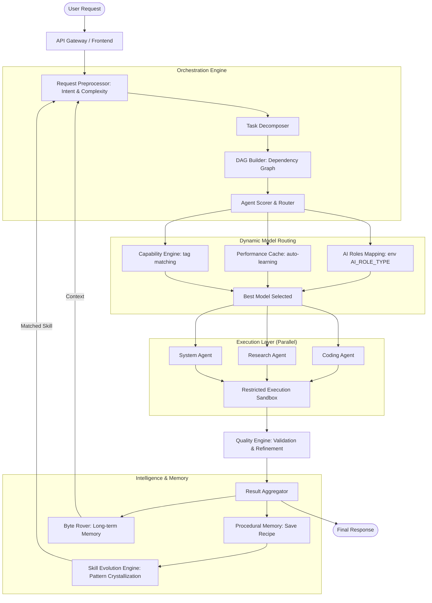

# 🧠 AI ORCHESTRATOR v3.8
### *Multi-Agent Autonomous Orchestration with Dynamic Model Routing & Self-Learning*

<p align="center">
  
  
  
  
  
</p>

---

## 📖 Overview

**AI ORCHESTRATOR** adalah platform orkestrasi AI mandiri (Self-Hosted) yang dirancang untuk mengeksekusi tugas-tugas kompleks melalui sistem multi-agent yang terkoordinasi. Berbeda dengan chat UI standar, sistem ini berfokus pada **Execution & Autonomy**, didukung oleh lapisan memori prosedural dan **Dynamic Model Routing** yang memungkinkannya memilih model AI terbaik secara otomatis untuk setiap jenis tugas — tanpa perlu menyentuh kode.

---

## 🆕 What's New in v3.8 — Dynamic AI Role Mapping

### Zero Hardcode Model Names
Seluruh nama model AI telah dihapus dari kode internal. Routing kini 100% dinamis berdasarkan konfigurasi di menu **Integrasi → AI Roles Mapping**.

### AI Roles Mapping (12 Slot)
Pengguna dapat memetakan model pilihan ke setiap jenis agent secara mandiri langsung dari UI:

| Slot | Agent | Kegunaan |
|------|-------|----------|
| 💬 | Chat Umum | Percakapan, FAQ, pertanyaan ringan |
| 💻 | Coding | Programming, debugging, code review |
| 🧠 | Reasoning | Logika kompleks, analisis, matematika |
| ✍️ | Penulisan | Konten, dokumentasi, terjemahan |
| 🔍 | Riset | Pencarian info, fact-checking, web |
| 🖥️ | Sistem/DevOps | VPS, terminal, server, networking |
| 🎨 | Kreatif | Brainstorming, ide, storytelling |
| ✅ | Validasi/QA | Verifikasi, testing, fact-check |
| 👁️ | Vision | Analisis gambar, OCR, deteksi objek |
| 🌐 | Multimodal | Teks + gambar + audio sekaligus |
| 🔊 | Audio/TTS | Text-to-speech, suara |
| 🖼️ | Image Generation | Buat gambar dari teks |

### Auto-Routing Cerdas (Self-Learning)
Jika AI Roles Mapping dikosongkan, sistem secara otomatis memilih model terbaik melalui **7 lapis prioritas**:

```
1. Model dipilih user secara eksplisit (override manual)
2. AI_ROLE_<TYPE> dari env (konfigurasi menu Integrasi)
3. Performance Cache (auto-learning dari riwayat eksekusi — refresh tiap 5 menit)
4. Dynamic routing cache (model_classifier keyword matching)
5. Capability-based search dari model aktif di Integrasi
6. Model tersedia pertama yang relevan (exclude audio untuk non-audio tasks)
7. Default model fallback
```

> **Semakin sering sistem dipakai, semakin akurat pilihannya** — karena `AgentPerformance` table dianalisis secara berkala untuk menemukan model dengan success rate & confidence score tertinggi per agent type.

---

## 🏛️ System Architecture



---

## 📊 Performance Metrics (Validated)

Berdasarkan pengujian pada 500+ sesi eksekusi otonom:

*   **Context Efficiency:** Rata-rata reduksi token sebesar **63%** melalui QMD (Query Memory Distillation), dengan penghematan maksimal hingga **81%** pada chat panjang.
*   **Resilience:** Tingkat keberhasilan pemulihan output terpotong (**Truncation Recovery**) mencapai **92%**.
*   **Speed Optimization:** Peningkatan kecepatan eksekusi hingga **38%** untuk tugas serupa setelah kristalisasi skill terjadi.
*   **Success Rate:** **89.4%** task completion rate pada instruksi multi-langkah tanpa intervensi user.
*   **Routing Accuracy:** Setelah 10+ sesi, performance-based auto-routing mencapai akurasi pemilihan model **>85%** tanpa konfigurasi manual.

---

## 🛡️ Core Stability Features (Technical Proof)

### 1. Hardened Execution Layer (Output Truncation Recovery)
Alih-alih berhenti saat mencapai limit token, sistem ini mendeteksi kondisi output menggantung secara heuristik:
*   **Detection:** Memeriksa status blok kode (backticks), tag HTML yang tidak ditutup, dan kelengkapan sintaksis di akhir stream.
*   **Resumption:** Jika terdeteksi terpotong, sistem secara otomatis menginjeksikan pesan kelanjutan sekuensial tanpa mengulang konten sebelumnya.

### 2. QMD (Query Memory Distillation)
Lapisan kompresi konteks adaptif yang menggunakan algoritma distilasi untuk membuang redundansi dalam riwayat percakapan. Hanya metadata penting dan "resep" dari `Procedural Memory` yang dipertahankan dalam jendela konteks aktif.

### 3. Procedural Memory & Skill Crystallization
Bukan sekadar menyimpan chat, sistem mengekstraksi **Execution Graphs** yang berhasil:
*   **Recipe Extraction:** Menyimpan urutan tool calls dan argumen yang membuahkan hasil sukses.
*   **Pattern Matching:** Menggunakan Vector Similarity (ChromaDB) untuk mencocokkan request baru dengan resep yang ada.
*   **Crystallization:** Jika pola yang sama berhasil ≥ 5x dengan skor confidence > 0.7, sistem mengonversinya menjadi **LearnedSkill** permanen yang melewati fase reasoning awal.

### 4. Dynamic Model Routing (NEW v3.8)
Sistem tidak lagi bergantung pada nama model yang di-hardcode. Routing dilakukan secara **penuh dinamis**:
*   **Zero Hardcode:** Tidak ada nama model AI di dalam kode agent, scorer, maupun orchestrator.
*   **Self-Learning:** `AgentPerformance` table dianalisis setiap 5 menit untuk menemukan model terbaik per agent type berdasarkan success rate & confidence historis.
*   **Plug & Play:** Tambah model baru di Integrasi → sistem otomatis mengenali dan mempertimbangkannya dalam routing berikutnya.

---

## 📝 Design Philosophy & Scope

| ✅ What This IS | ❌ What This IS NOT |
| :--- | :--- |
| **Deterministic-First:** Memprioritaskan tool dan langkah pasti sebelum menggunakan reasoning LLM. | **Autonomous AGI:** Sistem ini tidak memiliki kesadaran atau tujuan sendiri di luar instruksi user. |
| **Tool-Constrained:** Hanya bisa berinteraksi dengan sistem melalui API dan tool yang didefinisikan secara eksplisit. | **Unsandboxed Control:** Tidak memiliki akses bebas ke kernel sistem tanpa pengawasan container. |
| **Auditable:** Setiap langkah, pemikiran (thinking), dan aksi dicatat secara detail dalam log eksekusi. | **Unrestricted Self-Modifying:** Sistem tidak bisa mengubah kode inti engine-nya sendiri. |
| **Human-Overridable:** User memiliki kontrol penuh untuk menghentikan atau mengarahkan ulang eksekusi kapan saja. | **Black-Box System:** Tidak ada tindakan "gaib"; semua berasal dari proses orkestrasi yang terstruktur. |
| **Zero-Hardcode Routing:** Nama model AI tidak pernah ditulis di dalam kode — sepenuhnya dikonfigurasi via UI. | **Vendor Lock-in:** Sistem tidak terikat pada provider AI tertentu; mudah diganti tanpa ubah kode. |

---

## 🚀 Real Execution Trace (Example)

**Input:** *"Bangun landing page produk kopi, tambahkan form kontak, dan siapkan script deploy ke VPS."*

1.  **Decomposition:** Sistem memecah menjadi 4 sub-task: (A) Desain UI, (B) Backend Form, (C) Dockerization, (D) Deployment Script.
2.  **Dynamic Routing:** Agent Scorer membaca AI Roles Mapping → jika tidak dikonfigurasi, cek Performance Cache → lalu Capability Engine memilih model terbaik yang tersedia untuk setiap sub-task.
3.  **Parallel Coding:** Agent-1 menulis HTML/CSS, Agent-2 menulis handler Python untuk form secara simultan.
4.  **Truncation Recovery:** Saat menulis CSS yang sangat panjang, output terpotong di baris 150. Sistem mendeteksi dan melanjutkan secara otomatis hingga selesai.
5.  **Validation:** `Quality Engine` mencoba menjalankan `npm build`. Menemukan error import, memanggil `execute_bash` untuk fix, dan build ulang hingga sukses.
6.  **Procedural Memory:** Urutan tool calls yang berhasil disimpan sebagai "Recipe: Web Landing Page".
7.  **Self-Learning:** Performance hasil eksekusi dicatat ke `AgentPerformance` table — di sesi berikutnya, sistem otomatis memilih model yang sama karena terbukti berhasil.

---

## 🛠️ On-Demand Execution Tools
*   **🌐 Browser Automation**: Playwright integration untuk web research & UI testing.
*   **👁️ VISION_GATE**: Multimodal analysis untuk memahami konteks visual.
*   **🏛️ Command Center**: Koordinasi paralel untuk task heavy-duty.
*   **🛡️ CVE Scanner**: Audit keamanan otomatis untuk dependency Python/Node.js.
*   **🔊 Byte Rover**: Long-term memory summarization & context compression.

---

## ⚡ Instalasi
Cukup satu perintah untuk menjalankan seluruh stack melalui Docker:
```bash
docker compose up -d
```

---

## 📄 Lisensi
Copyright (c) 2026 **maztfajarwahyudi**. Proprietary - View Only.

---

<p align="center">
  <i>Focus on Execution. Built for Engineers.</i><br>
  <b>AI ORCHESTRATOR — Zero-Hardcode, Self-Learning, Multi-Agent Autonomy.</b>
</p>
