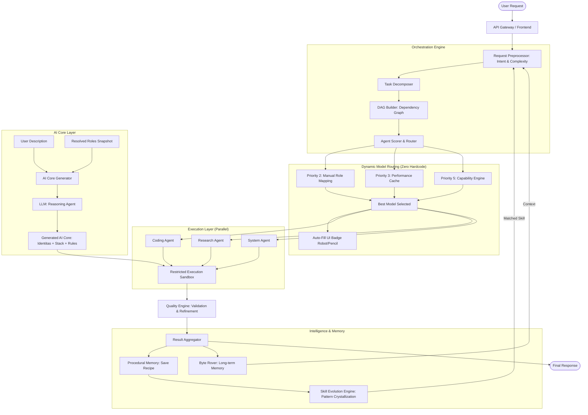

# 🧠 AI ORCHESTRATOR v4.1
### *High-Autonomy Execution, Hardened Resilience & Execution Continuity*

<p align="center">
  
  
  
  
  
  
</p>

---

## 📖 Overview

**AI ORCHESTRATOR** adalah platform orkestrasi AI mandiri (Self-Hosted) yang dirancang untuk mengeksekusi tugas-tugas kompleks melalui sistem multi-agent yang terkoordinasi. Berbeda dengan chat UI standar, sistem ini berfokus pada **Execution & Autonomy**, didukung oleh lapisan memori prosedural dan **Dynamic Model Routing** yang memungkinkannya memilih model AI terbaik secara otomatis untuk setiap jenis tugas — tanpa perlu menyentuh kode keras (Zero-Hardcode).

---

## 🌟 Core Features & Capabilities

Seluruh fitur mutakhir dari pembaruan sebelumnya (v3.8 hingga v4.1) kini telah disatukan dalam infrastruktur inti yang solid:

### 1. ⚡ High-Autonomy Execution & Scalability
*   **Native Function Calling (v4.1):** Orkestrasi kini didorong secara asli (*natively*) oleh standar JSON Schema bawaan dari penyedia model (OpenAI, Anthropic, Gemini, dll), memastikan akurasi pemanggilan alat (tool call) 95% bebas *syntax error* dan menghilangkan ketergantungan pada *regex parsing*.
*   **Infinite Sub-Task Decomposition:** Sistem sanggup memecah instruksi skala besar (*Fullstack App*, *Deployment*, *Database*) menjadi belasan langkah operasional tanpa terpotong oleh batasan sewenang-wenang (hard-limit).
*   **True Parallel Execution:** Menggunakan arsitektur Directed Acyclic Graph (DAG) di `Command Center`, agen-agen beroperasi secara bersamaan (paralel) untuk tugas-tugas yang tidak saling mengunci (*non-blocking*).
*   **Smart Botleneck Bypass:** Agen otomatis menyelesaikan path file yang salah, menimpa file (*overwrite*), dan membuat direktori secara mandiri. Intervensi manusia hanya diperlukan pada aksi destruktif tingkat sistem.

### 2. 🧠 Intelligence, Reasoning & Memory
*   **5-Tahap ReAct Reasoning:** Setiap eksekusi didahului dengan 5-tahap penalaran kognitif: *Intent Inference* → *Context Exploration* → *Plan* → *Execute* → *Verify*.
*   **QMD (Query Memory Distillation):** Algoritma kompresi konteks yang membuang redundansi percakapan sambil tetap menjaga format *whitespace/newline* pada kode secara ketat. Menghasilkan efisiensi token hingga **63%**.
*   **Procedural Memory & Skill Crystallization:** Mengekstraksi graf eksekusi (*tool calls*) yang berhasil ≥5x berturut-turut menjadi *Learned Skill* permanen agar sistem bekerja lebih cepat di kemudian hari.
*   **Auto-Generate AI Core:** Kemampuan menghasilkan profil identitas dan konfigurasi internal (*system prompt*) secara otomatis dari deskripsi bahasa natural pengguna dalam <10 detik.

### 3. 🔀 Dynamic Model Routing (Zero-Hardcode)
*   **Self-Learning Routing (>85% Accuracy):** Sistem menganalisis histori performa agen setiap 5 menit. Jika pengguna tidak menentukan model secara manual, sistem akan mendistribusikan *task* ke model paling kompeten secara dinamis berdasarkan 7-lapis prioritas.
*   **Transparent UI Auto-Fill:** Antarmuka secara jujur (`Real-time 30s`) menampilkan label `🤖 Auto — [Nama Model]` pada panel *Integrations* sehingga keputusan *routing* AI tidak lagi menjadi *black-box*.
*   **Absolute Manual Override:** Pilihan model manual dari pengguna adalah prioritas mutlak yang tidak akan pernah ditimpa oleh sistem otomatis (*auto-routing*).

### 4. 🛡️ Hardened Resilience & Execution Continuity
*   **State Checkpointing & DAG Watchdog:** Eksekusi tugas diamankan di dalam basis data persisten. Jika sistem macet atau progres stagnan lebih dari 5 giliran, Watchdog otomatis memaksa pemulihan tanpa instruksi halusinasi ke *LLM*.
*   **Actionable Error Translator & Circuit Breaker:** Sistem akan mengonversi pesan error teknis menjadi langkah taktis (misal: "Port bentrok, kill PID 1234"). Jika alat (*tool*) terus gagal 3x, ia akan dikenai penangguhan (*suspend*) sesi secara sementara agar tidak memblokir antrean.
*   **Truncation Recovery:** Jika LLM memotong *output* kode akibat limit *max_tokens*, Orchestrator secara otomatis menyuntikkan *prompt* pelanjut dan merekatkan hasilnya di balik layar.
*   **Dead Letter Queue (DLQ):** Setiap tugas gagal yang tidak tertolong (*unrecoverable*) akan masuk ke DLQ selama 14 hari untuk tujuan peninjauan manual, sehingga tidak ada pekerjaan yang lenyap tanpa jejak.

---

## 🏛️ System Architecture



---

## 💻 Hardware & AI Model Requirements

Untuk performa optimal terutama saat menjalankan **15+ agent secara paralel**:

| Komponen | Minimum | Rekomendasi |
|----------|---------|-------------|
| **RAM**  | 4 GB*   | 16 GB+      |
| **CPU**  | 2 Cores | 8 Cores+    |
| **Disk** | 20 GB   | 100 GB (SSD)|

*\*Catatan: Minimum 4GB disarankan untuk beban terbatas (~5-8 agent). Untuk kapasitas paralel maksimum, setidaknya dibutuhkan 8GB-16GB RAM.*

### ⚠️ Syarat Model AI (Penting!)
Sistem menggunakan **Native Function Calling** untuk eksekusi tanpa batas dan toleransi *error* maksimal. Gunakan tombol **Zap Test (⚡)** di menu *Integrations* untuk memeriksa kompatibilitas model.
*   **Model yang Didukung:** GPT-4o, gpt-4o-mini, Claude 3.5 Sonnet, Gemini 1.5/2.5 Pro/Flash, Llama 3/3.1, Qwen 2.5, Mistral-Nemo.
*   **TIDAK Didukung:** Model lawas (pra-2024), Llama 2, atau AI yang tidak mendukung kapabilitas penggunaan alat (*Tool Use*).

---

## 🔒 Security Model & Data Privacy

*   **Network Isolation:** Mode pekerja (*worker*) diisolasi penuh dalam kontainer Docker, sehingga tidak dapat mengakses OS *Host* maupun melakukan eksploitasi *kernel*.
*   **Privacy-Safe Prompting:** Nama asli LLM komersial disembunyikan menggunakan pelindung tiga lapis (*Prompt Alias*, *Post-processing Regex*, dan *Audit Log*) sehingga identitas LLM tidak bocor ke antarmuka klien.
*   **Wipe & Export:** Anda memiliki kontrol penuh. Memori dapat dihapus total (*wipe*) kapan saja lewat CLI atau UI. Riwayat percakapan dapat diekspor menjadi format PDF, DOCX, TXT, dan XLSX.

---

## 🚀 Real Execution Trace (Example)

**Input:** *"Bangun landing page produk kopi, tambahkan form kontak, dan siapkan script deploy ke VPS."*

1.  **Decomposition:** Sistem memecah belasan instruksi, dikelompokkan ke 4 sub-task utama: (A) Desain UI, (B) Backend Form, (C) Dockerization, (D) Deployment Script.
2.  **Dynamic Routing:** Agent Scorer mendeteksi AI Roles Mapping kosong → menggunakan *Performance Cache* → memilih AI paling jago *front-end* untuk (A) dan spesialis *devops* untuk (D).
3.  **Parallel Execution:** Agent-1 menulis HTML/CSS, Agent-2 merakit skrip Python/Node.js secara **bersamaan**.
4.  **Resilience:** Terjadi interupsi *Token Limit* di baris ke-150 CSS. *Truncation Recovery* menyambungnya otomatis di latar belakang.
5.  **Validation:** Terjadi error `EADDRINUSE` saat agen mencoba mengetes server. *Error Translator* memerintahkan `execute_bash` untuk mencari dan membunuh proses port terkait, lalu uji ulang sukses.
6.  **Crystallization:** Seluruh urutan sukses ini direkam ke *Procedural Memory*. Jika diminta hal serupa besok, sistem akan mengeksekusinya lebih instan.

---

## ⚡ Instalasi

### 1. Prasyarat Sistem
Pastikan sistem Anda (Linux/VPS) telah memiliki:
*   **Docker** (versi 24.0+) & **Docker Compose**
*   Port **3000** (Frontend) dan **8000** (Backend) tidak terblokir oleh Firewall (UFW).

### 2. Kloning Repositori & Konfigurasi
```bash
git clone https://github.com/maztfajarwahyudi/ai-super.git
cd ai-super

# Konfigurasi Environment (Opsional, konfigurasi default sudah cukup untuk berjalan)
cp .env.example .env
```

### 3. Build & Jalankan
Cukup satu perintah untuk membangkitkan seluruh arsitektur *Microservices*:
```bash
docker compose up -d --build
```
Sistem akan mulai merakit *container* backend, frontend, basis data vektor, dan lapisan *cache*.

---

## 🎮 Panduan Penggunaan (Quick Start)

Setelah instalasi selesai, ikuti langkah berikut untuk mengoperasikan AI Orchestrator:

1.  **Akses Dashboard:** Buka peramban web dan navigasi ke `http://localhost:3000` (atau IP VPS Anda).
2.  **Konfigurasi Kunci API (Wajib):** 
    *   Buka menu ⚙️ **Integrations**.
    *   Masukkan API Key dari penyedia LLM pilihan Anda (misal: OpenAI, Anthropic, Gemini, Groq, atau endpoint lokal Ollama).
    *   Klik **Simpan**.
3.  **Verifikasi Native Tools:**
    *   Masih di menu Integrations, klik tombol petir **Zap Test (⚡)** di samping model AI pilihan Anda.
    *   Pastikan notifikasi memunculkan indikator warna **Hijau** (Mendukung *Native Tools*). Jika merah/kuning, AI tersebut tidak kompatibel dengan orkestrasi lanjutan.
4.  **Atur AI Roles (Opsional):**
    *   Buka menu 🤖 **AI Roles Mapping**.
    *   Anda bisa mengatur model spesifik untuk tugas tertentu (misal: *Claude 3.5 Sonnet* untuk Coding, *Gemini 1.5 Pro* untuk Riset). Jika dikosongkan, fitur *Auto-Routing* akan menanganinya untuk Anda.
5.  **Mulai Memberi Perintah:**
    *   Kembali ke Dashboard/Chat. Berikan instruksi kompleks seperti: *"Deploy aplikasi Express.js sederhana di port 8080 dengan endpoint /ping."*
    *   Duduk santai dan perhatikan agen merencanakan DAG, menulis *source code*, mengeksekusi *bash*, memperbaiki *error* secara otonom, dan mengembalikan tautan yang sudah siap pakai!

---

## 📄 Lisensi
Copyright (c) 2026 **maztfajarwahyudi**. Proprietary - View Only.

<br>
<p align="center">
  <i>Focus on Execution. Built for Engineers.</i><br>
  <b>AI ORCHESTRATOR v4.1 — A True High-Autonomy Engineering Agent.</b>
</p>
