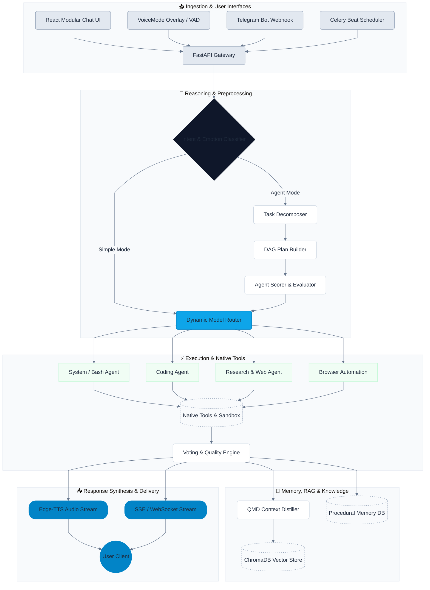

# 🧠 AI ORCHESTRATOR v4.1.52
### *High-Autonomy Multi-Agent Execution, Real-Time Voice Interaction & Resilient Orchestration*

<p align="center">
  
  
  
  
  
  
  
</p>

---

## 📖 Overview

**AI ORCHESTRATOR** adalah platform orkestrasi AI otonom mandiri (*Self-Hosted*) yang dirancang untuk mengeksekusi tugas-tugas rekayasa dan operasional skala kompleks melalui sistem multi-agent yang terkoordinasi. 

Berbeda dengan antarmuka percakapan konvensional, AI ORCHESTRATOR mengedepankan **Full Autonomy & Native Tool Calling**, didukung arsitektur **Directed Acyclic Graph (DAG)**, memori prosedural cerdas, pemrosesan suara dua arah (*Voice-to-Voice with VAD*), serta **Dynamic Model Routing** yang memilih model AI paling efisien dan kompeten secara otomatis tanpa konfigurasi kaku (*Zero-Hardcode*).

---

## 🌟 Core Features & Capabilities

### 1. ⚡ High-Autonomy Execution & Native Tools
* **Native Function Calling:** Orkestrasi terintegrasi langsung dengan standar JSON Schema bawaan dari provider model (OpenAI, Anthropic Claude, Google Gemini, Groq, DeepSeek, Ollama, dll.), menghasilkan akurasi pemanggilan alat (*tool calls*) tinggi dan bebas kegagalan sintaks regex.
* **Modular Chat Engine & Agent Progress:** Antarmuka percakapan modular (`ChatInput`, `MessageList`, `AgentProgress`) dengan visualisasi proses berpikir agen (*Thinking Process*), status langkah demi langkah, dan *live step-by-step telemetry*.
* **Browser Automation Tools:** Agen memiliki kapabilitas navigasi web otonom (`browser_navigate`), interaksi elemen (`browser_click`, `browser_type`), ekstraksi konten teks (`browser_extract_text`), dan penangkapan visual halaman (`browser_screenshot`).
* **AI Image Generation:** Integrasi pembuatan gambar (`generate_image`) teks-ke-gambar berbasis Pollinations AI (100% gratis, tanpa API key) dan provider kustom dengan opsi rasio dinamis (square, landscape, portrait).
* **Infinite Sub-Task Decomposition:** Pemecahan instruksi skala besar (*Fullstack App*, *Refactoring*, *DevOps*, *Database Migration*) menjadi langkah-langkah operasional yang dieksekusi secara terstruktur tanpa terpotong limit token.
* **True Parallel Execution (DAG):** Agen-agen beroperasi secara simultan (*non-blocking*) melalui graph eksekusi terkoordinasi di `Command Center`.

### 2. 🎙️ Voice-to-Voice Realtime Mode (NEW!)
* **Interactive Voice Overlay (`VoiceMode`):** Antarmuka percakapan suara interaktif layar penuh dengan animasi visualizer dinamis, status indikator (Listening, Processing, Speaking), dan Voice Activity Detection (VAD).
* **Realtime Speech Recognition & Edge-TTS:** Transkripsi suara pengguna secara instan (Web Speech API / Whisper) dipadukan dengan sintesis suara *edge-tts* multi-bahasa (Indonesia, English, Arabic, Japanese, Jawa) dengan latensi ultra-rendah dan tanpa biaya.
* **Smart Audio Interruption & Privacy-First:** Deteksi interupsi otomatis saat pengguna berbicara kembali serta pemrosesan audio efemeral tanpa penyimpanan rekaman sensitif di server.

### 3. 🧠 Intelligence, Reasoning & Memory Systems
* **5-Stage ReAct Reasoning:** Setiap eksekusi didahului penalaran kognitif bertahap: *Intent Inference* → *Context Exploration* → *Plan* → *Execute* → *Verify*.
* **Intent Classifier & Emotional State Engine:** Analisis niat (*intent*) dan kondisi emosional pengguna (urgensi, nada, kepuasan, kebutuhan validasi) untuk menyesuaikan prioritas eksekusi dan gaya bahasa model secara otomatis.
* **Humanizer Engine:** Modul pemoles bahasa yang menyaring frasa-frasa klise mesin yang kaku agar komunikasi lebih luwes, asimetris, dan natural.
* **QMD (Query Memory Distillation):** Algoritma kompresi konteks percakapan yang membuang redundansi tanpa merusak struktur kode atau token penting, menghemat hingga **63% token**.
* **Vector RAG & Knowledge Base:** Integrasi ChromaDB lokal untuk pengindeksan dokumen, pencarian semantik berkecepatan tinggi, dan *project context loading*.
* **Procedural Memory & Learned Skills:** Kristalisasi graf eksekusi yang sukses ≥5 kali menjadi skill permanen baru untuk akselerasi eksekusi tugas serupa di masa depan.
* **Multi-Model Consensus / Voting Engine:** Menjalankan beberapa LLM secara paralel untuk tugas kritis (skor kompleksitas ≥ 0.8) guna menyatukan hasil terbaik.

### 4. 🔀 Dynamic Model Routing (Zero-Hardcode)
* **Self-Learning Performance Routing:** Analisis otomatis performa model berdasarkan latensi, akurasi, dan jenis tugas (Coding, Research, Creative, Multimodal) untuk mengarahkan prompt ke model terbaik.
* **AI Roles Mapping:** Pemetaan peran fleksibel di mana pengguna dapat menetapkan model spesifik untuk tugas tertentu (*Coding Agent*, *Research Agent*, *Vision Agent*, dll.) atau membiarkan sistem melakukan *Auto-Routing*.
* **Latest Model Capabilities Support:** Kompatibel dengan model generasi terbaru (Gemini 2.5/3.1, Claude 3.5/3.7 Sonnet, GPT-4o, DeepSeek-V3/R1, Qwen 2.5 Coder, Ollama lokal, dsb).

### 5. 🛡️ Hardened Resilience & Security
* **State Checkpointing & Watchdog:** Penyimpanan status eksekusi persisten dengan pemulihan otomatis jika terjadi *freeze* atau anomali jaringan.
* **Actionable Error Translator & Circuit Breaker:** Penerjemahan error teknis menjadi langkah koreksi nyata (misal: penanganan konflik port otomatis) dan isolasi alat bermasalah.
* **Truncation Auto-Recovery:** Penyambungan otomatis kode atau respons teks yang terpotong akibat limit *max_tokens*.
* **Enterprise Security & 2FA:** Otentikasi dua faktor (TOTP 2FA), audit logging komprehensif, security scanner untuk mendeteksi kerentanan file, dan approval system untuk perintah berbahaya.
* **Cloudflare Tunnel Wizard:** Integrasi wizard bawaan untuk mengekspos dashboard ke domain HTTPS publik secara instan tanpa perlu port-forwarding manual.

---

## 🏛️ System Architecture


```mermaid
%%{init: {
  'theme': 'base',
  'themeVariables': {
    'primaryColor': '#ffffff',
    'primaryTextColor': '#1e293b',
    'primaryBorderColor': '#cbd5e1',
    'lineColor': '#64748b',
    'secondaryColor': '#f8fafc',
    'tertiaryColor': '#f1f5f9'
  },
  'flowchart': { 'curve': 'monotoneX' }
}}%%

graph TB
    %% Styling
    classDef entry fill:#e2e8f0,stroke:#94a3b8,stroke-width:1px,rx:5px,ry:5px;
    classDef process fill:#ffffff,stroke:#cbd5e1,stroke-width:1px,rx:6px,ry:6px;
    classDef router fill:#0f172a,textColor:#ffffff,stroke:#0f172a,stroke-width:1px,rx:4px,ry:4px;
    classDef engine fill:#0ea5e9,textColor:#ffffff,stroke:#0284c7,stroke-width:1px,rx:4px,ry:4px;
    classDef agent fill:#f0fdf4,stroke:#bbf7d0,textColor:#166534,stroke-width:1px;
    classDef db fill:#f8fafc,stroke:#94a3b8,stroke-dasharray: 3 3,rx:8px,ry:8px;
    classDef output fill:#0284c7,textColor:#ffffff,stroke:#0284c7,stroke-width:1px,rx:20px;

    %% LAYERS
    subgraph EP ["📥 Ingestion & User Interfaces"]
        UI[React Modular Chat UI]
        VM[VoiceMode Overlay / VAD]
        TG[Telegram Bot Webhook]
        CB[Celery Beat Scheduler]
        
        UI & VM & TG & CB --> AG[FastAPI Gateway]
    end

    subgraph OR ["🧠 Reasoning & Preprocessing"]
        AG --> IC{Intent & Emotion Classifier}
        IC -->|Simple Mode| DR[Dynamic Model Router]
        IC -->|Agent Mode| TD[Task Decomposer]
        TD --> DAG[DAG Plan Builder]
        DAG --> AS[Agent Scorer & Evaluator]
        AS --> DR
    end

    subgraph EX ["⚡ Execution & Native Tools"]
        DR --> SA[System / Bash Agent]
        DR --> CA[Coding Agent]
        DR --> RA[Research & Web Agent]
        DR --> BA[Browser Automation]
        
        SA & CA & RA & BA --> Tools[(Native Tools & Sandbox)]
        Tools --> VE[Voting & Quality Engine]
    end

    subgraph IM ["💾 Memory, RAG & Knowledge"]
        QMD[QMD Context Distiller]
        VDB[(ChromaDB Vector Store)]
        PM[(Procedural Memory DB)]
        
        VE --> QMD
        QMD --> VDB
        VE --> PM
    end

    subgraph OUT ["📤 Response Synthesis & Delivery"]
        VE --> TTS[Edge-TTS Audio Stream]
        VE --> Stream[SSE / WebSocket Stream]
        TTS & Stream --> Client((User Client))
    end

    %% Class Assignments
    class UI,VM,TG,CB,AG entry;
    class IC router;
    class TD,DAG,AS,VE,QMD process;
    class DR engine;
    class SA,CA,RA,BA agent;
    class Tools,VDB,PM db;
    class TTS,Stream,Client output;

    style EP fill:#f8fafc,stroke:#e2e8f0,stroke-width:1px;
    style OR fill:#f8fafc,stroke:#e2e8f0,stroke-width:1px;
    style EX fill:#f8fafc,stroke:#e2e8f0,stroke-width:1px;
    style IM fill:#f8fafc,stroke:#e2e8f0,stroke-width:1px;
    style OUT fill:#f8fafc,stroke:#e2e8f0,stroke-width:1px;
```

---

## 📁 Repository Structure

```text
ai-super/
├── backend/
│   ├── agents/             # Agent definitions, tools (bash, browser, filesystem), voting engine
│   ├── api/                # FastAPI endpoints (chat, voice/tts, auth, integrations, qmd, rag)
│   ├── core/               # Orchestrator, intent classifier, DAG builder, QMD, model manager
│   ├── db/                 # Database models, SQLite WAL session management
│   ├── memory/             # Procedural & episodic memory management
│   ├── rag/                # ChromaDB vector engine and document indexer
│   └── main.py             # FastAPI entrypoint and concurrent startup lifecycle
├── frontend/
│   ├── src/
│   │   ├── components/     # UI components (VoiceMode, CloudflareWizard, File Manager)
│   │   │   └── chat/       # Modular Chat (ChatInput, MessageList, AgentProgress)
│   │   ├── pages/          # App views (Chat, Dashboard, Integrations, Security, Models)
│   │   ├── hooks/          # Custom React hooks (speech, audio, telemetry)
│   │   └── App.jsx         # App router and global context providers
│   ├── package.json        # Frontend dependencies & Vite configuration
│   └── vite.config.js      # Vite build setup with aggressive asset bundling
├── scripts/                # Utility and deployment scripts
├── .env.example            # Environment variables template
├── start.sh / stop.sh      # Native service management scripts
├── update.sh               # One-click update and dependency installation script
└── VERSION                 # Active release version identifier
```

---

## 💻 Hardware & AI Model Requirements

| Komponen | Minimum | Rekomendasi |
|----------|---------|-------------|
| **RAM**  | 4 GB    | 16 GB+      |
| **CPU**  | 2 Cores | 8 Cores+    |
| **Disk** | 20 GB   | 100 GB SSD  |

### ⚠️ Kompatibilitas Model AI (Native Function Calling)
Sistem dioptimalkan untuk model yang mendukung **Native Tool Calling / Function Calling**:
* **Didukung Penuh:** OpenAI (GPT-4o, GPT-4o-mini), Anthropic (Claude 3.5/3.7 Sonnet), Google Gemini (Gemini 2.5 Pro/Flash, Gemini 3.1 Flash-Lite), Groq, DeepSeek (V3/R1), Qwen 2.5, Mistral, Ollama (Llama 3.1/3.2, Qwen2.5-Coder).
* **Verifikasi Cepat:** Gunakan tombol petir **Zap Test (⚡)** pada menu *Integrations* untuk memvalidasi dukungan Native Tools model secara instan.

---

## ⚡ Panduan Instalasi & Menjalankan

### 1. Prasyarat Sistem
Pastikan lingkungan Anda (Linux Ubuntu/Debian/Mac) telah terpasang:
* **Python 3.10+** dan `python3-venv`
* **Node.js 18+** dan `npm`
* Port **7860** terbuka.

### 2. Kloning Repositori & Konfigurasi Lingkungan
```bash
git clone https://github.com/maztfajarwahyudi/ai-super.git
cd ai-super

# Siapkan file konfigurasi environment
cp .env.example .env

# Edit kredensial admin dan variabel lingkungan
nano .env
```

### 3. Instalasi Dependensi & Build
Jalankan skrip pembaruan otomatis untuk mengunduh seluruh dependensi frontend dan backend:
```bash
./update.sh
```

### 4. Menjalankan Layanan
Aplikasi dapat dikontrol dengan skrip berikut:
* **Menjalankan aplikasi:** `./start.sh`
* **Menghentikan aplikasi:** `./stop.sh`
* **Melihat log backend:** `tail -f backend/backend_log.txt`

Akses dashboard web melalui browser di: `http://localhost:7860` (atau IP server Anda).

---

## 🎮 Quick Start Guide

1. **Login:** Masuk dengan `ADMIN_USERNAME` dan `ADMIN_PASSWORD` dari file `.env`.
2. **Setup Integrasi:** Buka menu ⚙️ **Integrations**, masukkan API Key provider LLM Anda, dan klik **Simpan**.
3. **Uji Kompatibilitas:** Klik tombol **⚡ Zap Test** pada model yang aktif untuk memastikan fungsi *Native Tools* aktif.
4. **Gunakan Mode Suara (VoiceMode):** Klik ikon mikrofon pada halaman Chat untuk membuka *VoiceMode* dan berbicara langsung dengan AI.
5. **Jalankan Perintah Otonom:** Ketik perintah rekayasa lengkap di halaman Chat, aktifkan mode **🤖 Agent**, dan pantau agen bekerja menyelesaikan DAG secara transparan.

---

## 📄 Lisensi
Copyright (c) 2026 **maztfajarwahyudi**. Proprietary - View Only.

<br>
<p align="center">
  <i>Built for High-Autonomy Engineering & Intelligent Automation.</i><br>
  <b>AI ORCHESTRATOR v4.1.52</b>
</p>
