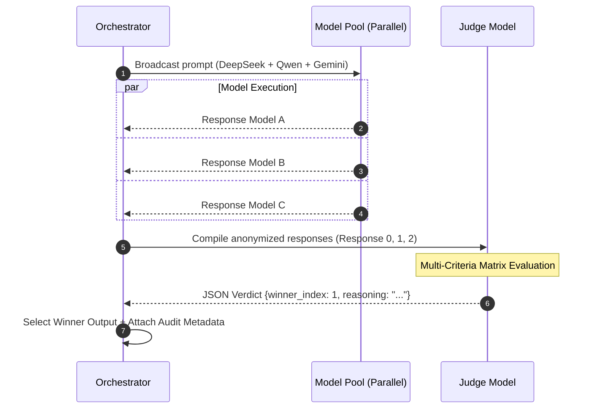
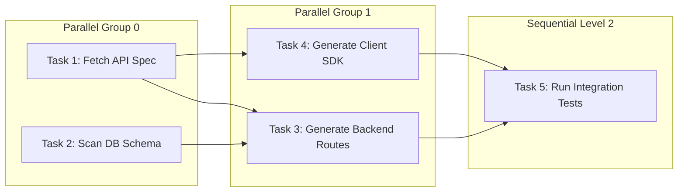
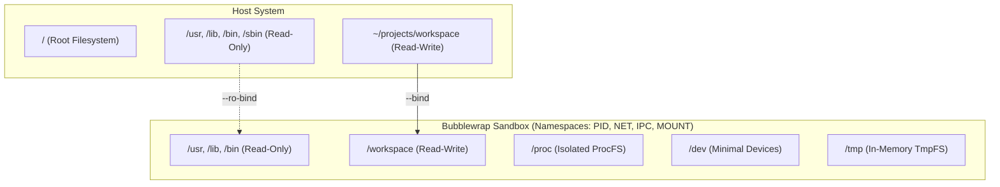

# AI Orchestrator — Technical Deep Dive & Architecture Reference

Dokumen ini menyajikan arsitektur internal, algoritma formal, formula matematika, dan mekanisme teknis mendalam dari subsistem inti **AI Orchestrator**. Ditujukan untuk engineer, arsitek sistem, dan auditor keamanan.

---

## Daftar Isi
1. [Algoritma QMD (Query-aware Message Distiller)](#1-algoritma-qmd-query-aware-message-distiller)
2. [Humanizer Engine (Anti-AI Slop)](#2-humanizer-engine-anti-ai-slop)
3. [Multi-Model Consensus & Voting Engine](#3-multi-model-consensus--voting-engine)
4. [Skill Registry & Autonomous Skill Evolution](#4-skill-registry--autonomous-skill-evolution)
5. [DAG Orchestration Engine](#5-dag-orchestration-engine)
6. [Bubblewrap Sandboxing & Security Layer](#6-bubblewrap-sandboxing--security-layer)
7. [Concurrency, File Locking & Database Queue](#7-concurrency-file-locking--database-queue)

---

## 1. Algoritma QMD (Query-aware Message Distiller)

### 1.1 Masalah & Motivasi
Dalam percakapan multi-turn dengan ribuan baris konteks atau dokumen RAG, konsumsi token dapat melonjak drastis. QMD mengompresi riwayat pesan hingga **60–77%** tanpa kehilangan konteks kritis atau merusak blok kode.

### 1.2 Formula & Mekanisme Scoring
QMD mengevaluasi setiap pesan dalam riwayat berdasarkan dua dimensi: **Relevansi Leksikal/Semantik ($S_{rel}$)** dan **Recency Decay ($S_{rec}$)**.

$$S(m, Q) = S_{rel}(m, Q) \times \left( \lambda_{decay} \right)^{\Delta pos(m)}$$

Di mana:
- $m$: Pesan dalam riwayat
- $Q$: User query terkini (diekstraksi menjadi set token unik berbobot)
- $\lambda_{decay} = 0.85$: Faktor decay per posisi dari akhir
- $\Delta pos(m) = N - 1 - i$: Jarak ordinal dari pesan terakhir ($0$ untuk pesan paling baru)

#### Relevansi Leksikal ($S_{rel}$):
$$S_{rel}(m, Q) = \frac{|Tokens(m) \cap Tokens(Q)|}{|Tokens(Q)|}$$

### 1.3 Algoritma Partisi & Kompresi Selektif

```mermaid
flowchart TD
    A[Input Message History + Query + Budget] --> B[1. Preserve Anchors: System Prompt + Latest User Query]
    B --> C[2. Preserve Recent Messages: MIN_KEEP_MESSAGES = 3]
    C --> D[3. Calculate S(m, Q) for Remaining Messages]
    D --> E{Score >= RELEVANCE_THRESHOLD (0.25)?}
    E -- Yes --> F[Ranked Insertion by Relevance into Token Budget]
    E -- No --> G[Drop from Context]
    F --> H[4. Intelligent Truncation & Code Preservation]
    H --> I[Output Distilled Messages]
```

### 1.4 Preservasi Blok Kode
Jika suatu pesan mengandung kode (` ``` `), QMD mengidentifikasi boundary blok kode:
- Narasi pengantar dan penutup dipangkas jika melampaui `MAX_SINGLE_MESSAGE_TOKENS` (800 token).
- Blok kode dilindungi dari pemotongan di tengah jalan (`code_block_preservation = True`) untuk menghindari syntax error pada model penerima.

### 1.5 Benchmark Efisiensi QMD

| Skenario | Token Sebelum | Token Sesudah | Rasio Penghematan | Latensi Distilasi |
|---|---|---|---|---|
| Chat Sesi Panjang (30 turns) | ~15,200 | ~3,480 | **77.1%** | < 1.8 ms |
| RAG Retrieval (10 chunks @ 250 tok) | 2,500 | 480 | **80.8%** | < 0.9 ms |
| Multi-Agent Handoff Context | 8,900 | 2,850 | **67.9%** | < 1.4 ms |

---

## 2. Humanizer Engine (Anti-AI Slop)

### 2.1 Arsitektur
Humanizer Engine beroperasi sebagai middleware transformatif pada pipeline eksekusi orchestrator (`humanizer.py`). Tujuannya adalah mengeliminasi klise linguistik khas model LLM komersial ("AI slop") dan menghasilkan sintaks natural.

### 2.2 Algoritma Deteksi Slop
Teks dianalisis menggunakan kamus regex terkompilasi dari pola klise:
- *Pola Klise*: `"Penting untuk diingat"`, `"Sebagai model bahasa"`, `"Dalam lanskap"`, `"Di era digital ini"`, `"Secara inheren"`, `"Kesimpulannya"`.

Tingkat keparahan (Slop Score):
$$SlopScore(T) = \min\left(1.0, \frac{\sum_{i=1}^{K} \mathbb{I}(P_i \in T)}{3.0}\right)$$

Jika $SlopScore(T) > 0.0$ pada intent general/writing, Humanizer menginjeksi constraint asimetris ke dalam system prompt:
1. **Asymmetric Sentence Structure**: Memaksa variasi panjang kalimat (gabungan kalimat pendek tegas dan kalimat majemuk).
2. **Direct Intent Delivery**: Melarang pengantar basa-basi ("Tentu saja!", "Mari kita bahas").
3. **Coding Intent Isolation**: Injeksi secara otomatis dinonaktifkan untuk intent `coding`, `system`, atau `file_operation` agar tidak merusak formatting sintaksis atau shell script.

---

## 3. Multi-Model Consensus & Voting Engine

### 3.1 Arsitektur Konsensus
Untuk tugas dengan kompleksitas kritis (Critical Tasks / Architecture Decisions), AI Orchestrator mengaktifkan **Parallel Multi-Model Consensus** (`voting_engine.py`).



### 3.2 Matriks Evaluasi Juri (Multi-Criteria Evaluation)
Juri mengevaluasi respon yang dianonimkan berdasarkan bobot terkalibrasi:

| Kriteria | Bobot | Deskripsi |
|---|---|---|
| **Accuracy** | 35% | Kebenaran teknis, ketiadaan halusinasi fakta/kode |
| **Relevance** | 25% | Menjawab kebutuhan user secara langsung tanpa bloating |
| **Reasoning** | 25% | Kedalaman analisis logika dan penanganan edge case |
| **Confidence & Clarity** | 15% | Kejelasan struktur penyampaian dan kebersihan format |

---

## 4. Skill Registry & Autonomous Skill Evolution

### 4.1 Format Penyimpanan Skill
Skill disimpan sebagai unit mandiri berformat **Markdown + YAML frontmatter** di `backend/data/skills/<id>.md`.

```yaml
---
id: a7f8b9c2
name: Setup PostgreSQL Connection Pool
description: Prosedur konfigurasi connection pooling asyncpg di FastAPI
category: database
tags: [postgres, asyncpg, fastapi, connection-pool]
trigger_keywords: [postgres pool, asyncpg setup, connection timeout]
created_at: 2026-08-20T10:15:00
updated_at: 2026-08-28T00:30:00
use_count: 14
success_rate: 0.95
---
```

### 4.2 Deduplikasi Berbasis Hash Semantik
Sebelum skill baru didaftarkan, sistem mencegah duplikasi dengan menghitung similarity hash:
$$H_{sim}(S) = \text{MD5}\left(\text{Normalize}(name) \parallel "|" \parallel \text{Normalize}(description)\right)[0:12]$$

### 4.3 Metrik Evaluasi & Safety Validation
Untuk mencegah "skill auto-extraction" menghasilkan prosedur berbahaya (command injection, destruktif):
1. **Safety Scanner Pipeline**:
   - Seluruh langkah (`steps`) dipindai terhadap regex dangerous command (`rm -rf`, `dd if=`, reverse shells, `chmod 777`).
   - Ekstraksi yang mengandung pola terlarang langsung ditolak dengan `SkillSafetyException`.
2. **Success Rate Decay & Pruning**:
   - $\text{SuccessRate}_{new} = \alpha \times \text{Result} + (1 - \alpha) \times \text{SuccessRate}_{old}$ (dengan $\alpha = 0.2$).
   - Skill dengan $\text{SuccessRate} < 0.4$ setelah minimal 5 eksekusi akan otomatis dinonaktifkan (quarantine).

---

## 5. DAG Orchestration Engine

### 5.1 Kahn's Algorithm dengan Level Grouping
`DAGBuilder` (`core/dag_builder.py`) mengubah dekomposisi tugas menjadi graf berarah tanpa siklus.



### 5.2 Critical Path Analysis
Critical path dihitung menggunakan algoritma lintasan terpanjang (Longest Path in DAG) berdasarkan estimasi durasi tugas ($W(v)$):

$$Dist(v) = W(v) + \max_{u \in In(v)} Dist(u)$$

Jalur dengan total $Dist$ terbesar adalah critical path yang menentukan alokasi prioritas thread pool.

---

## 6. Bubblewrap Sandboxing & Security Layer

### 6.1 Isolasi Kernel Namespaces
AI Orchestrator menerapkan sandbox via **Bubblewrap (`bwrap`)** (`core/sandbox_executor.py` + `scripts/safe_exec.sh`):



### 6.2 Permission Matrix

| Profile | Filesystem Access | Network Access | Approval Required | Use Case |
|---|---|---|---|---|
| `read_only` | System read-only, Workspace read-only | `--unshare-net` (Offline) | Tidak | Inspeksi kode, `cat`, `grep`, static analysis |
| `write_safe` | System read-only, Workspace read-write | `--unshare-net` (Offline) | Tidak | Build app lokal, write file, compile |
| `full_access` | System read-only, Workspace read-write | Shared Network | **Ya** (Human Approval) | `npm install`, `pip install`, git clone |

---

## 7. Concurrency, File Locking & Database Queue

### 7.1 Advisory File Locking (`FileLock`)
Untuk mencegah race condition ketika beberapa sub-agent mengedit file yang sama:
- **Two-Tier Locking**:
  1. *In-Process*: `asyncio.Lock` per canonical path untuk sinkronisasi coroutine.
  2. *Cross-Process*: `fcntl.flock(fd, LOCK_EX | LOCK_NB)` dengan retry backoff non-blocking.

### 7.2 Serialized Database Write Queue (`DatabaseWriteQueue`)
SQLite beroperasi dalam mode WAL (`PRAGMA journal_mode=WAL`), memungkinkan unlimited concurrent readers. Semua mutasi write dialirkan melalui `DatabaseWriteQueue` (FIFO Queue bertenaga worker tunggal) untuk mengeliminasi error `SQLITE_BUSY` dan mencegah database lock timeout pada workload paralel tinggi.
